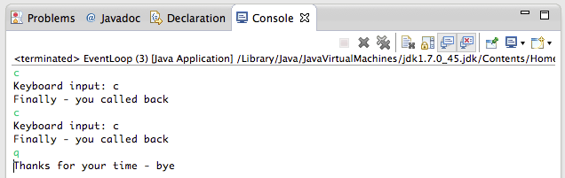

#Exercise 1 Solution

Create a new package **org.wit.callbackexercise** in the project **event_handling**.

- Add a KeyBoardListener interface.

##KeyBoardListener##

Here is the specified listener:

```
package org.wit.callbackexercise;

import org.wit.callback.TextWatcher;

public interface KeyBoardListener extends TextWatcher
{
  void onKeyBoardInput();
}

```

##EventLoop##

Modify *org.wit.callbackexercise.EventLoop.java*:

- Have EventLoop implement KeyBoardListener:

```
public class EventLoop implements  KeyBoardListener
```
- Add the necessary import statement:
    - import org.wit.callback.TextWatcher;
- Implement the required override methods:

```
  @Override
  public void onKeyBoardInput()
  {
    System.out.println("Keyboard input: " + keyboardInput);   
  }

  @Override
  public void onTextChanged(String changedtext)
  {
    System.out.println("Finally - you called back");
  }
```

- In EventLoop register a reference to the object whose class implements listener, namely **this**:

```
textview.addTextChangedListener(this);
```

##KeyPress##

Complete the skeleton code provided: *org.wit.callbackexercise.Keypress.java*:

- Save the object for later use:

```
  public void addKeyBoardListener(KeyBoardListener listener)
  {
    super.textwatcher = listener;
  }
```

In *doWork()*:

- Invoke onKeyBoardInput()

```
((KeyBoardListener)textwatcher).onKeyBoardInput();
```
- Invoke onTextChanged

```
textwatcher.onTextChanged("Finally - you called back");
```

Here is the complete method:

```
  @Override
  public void doWork()
  {
    // Check the predicate, which is set elsewhere.
    if (somethingHappened)
    {
      // Signal the event by invoking the interface's method.
      ((KeyBoardListener)textwatcher).onKeyBoardInput();
      textwatcher.onTextChanged("Finally - you called back");
      somethingHappened = false;
    }
  }
```

We need to make a change to some of the existing code, namely *org.wit.callback.TextView*:

- Note that in KeyPress we require access to the super class TextView
    - TextWatcher textwatcher
    - boolean somethingHappened

We can do this in any of the following ways:

- Declare both fields *public*
- Introduce *getter* methods 
- Declare both fields *protected*.

Change the fields to protected:

```
  protected TextWatcher textwatcher;
  protected boolean somethingHappened;
```

The code should now be error-free.

Test as follows:

- In the Package Explorer select *org.wit.callbackexercise.EventLoop.java*
    - Run as Java Application
    - Bring the console window into focus by placing the mouse cursor anywhere within it and pressing the left mouse button.
    - Type the lower case character **c** and press return.
    - You should see this:
    
    - Repeat a number of times. 
    - The same output should be repeated.
    - To quit enter the lower case character **q**.


A complete project containing the solution may be downloaded using a link in the next step.


