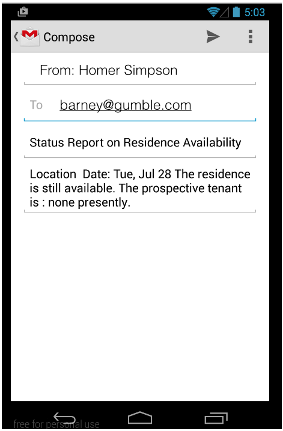

#ResidenceActivity - Email

Now we can engage the report button to actually send the email.

The imports:

~~~
import static org.wit.android.helpers.ContactHelper.sendEmail;
~~~

The Button object:

~~~
private Button   reportButton;
~~~

Initialisation of the button:

~~~
reportButton = (Button)   findViewById(R.id.residence_reportButton);
~~~

Enabling the event handler:

~~~
reportButton.setOnClickListener(this);
~~~

The event handler itself:

~~~
  @Override
  public void onClick(View v)
  {
    switch (v.getId())
    {
      //...

      case R.id.residence_reportButton : 
        sendEmail(this, emailAddress,
         getString(R.string.residence_report_subject), residence.getResidenceReport(this));
        break;                                        
    }
  }
~~~

Test this now. Make sure the contact you select actually has an email address in the contact info. If you attempt to test this feature on an Android emulator then it appears you require to use an online account's contacts else you may encounter an `unsupported acion` error with no explanation as to its cause. One approach that works is to send the email message to your own account.

If gmail is the default mail handling app, it may look like this:

The application at the end of this lab is available for reference here: [myrent-06](https://github.com/wit-ictskills-2016/myrent-06.git)