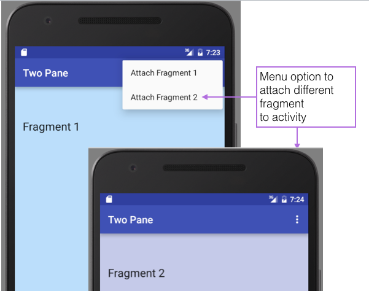
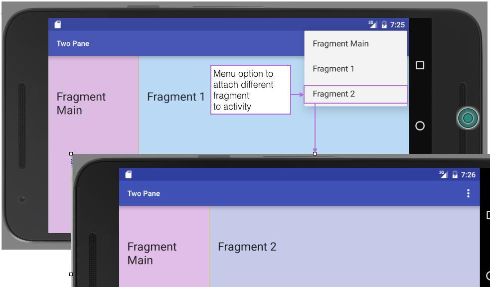

#Preview

Many strategies exist for creating screen layouts. Some of these are discussed in the official documentation article [Design for Multiple Tablet Orientations](https://developer.android.com/training/design-navigation/multiple-sizes.html). In this lab we provide a simple demonstration of the master-detail pattern in landscape mode. A single pane (activity) simultaneously hosts two fragments.

 In portrait mode in the demonstration, a pane may support only one fragment at any one time.  A menu option is provided to attach either of two fragments to a single activity. This is  illustrated here in Figures 1 and 2.

 

