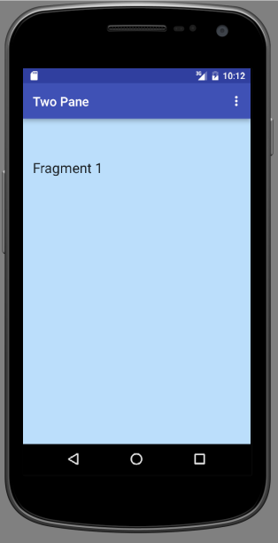

#Activity

Refactor the default MainActivity Java file as follows:

Add an ActionBar field:

```

  ActionBar actionBar;

```

Initialize it in `onCreate`:

```
    actionBar = getSupportActionBar();


```

Provide this import:

```

import android.support.v7.app.ActionBar;

```

Use the FragmentManager to add and commit a new transaction using an instance of a fragment as a parameter. Add this code snippet to the end of `onCreate`:

```
    FragmentManager manager = getSupportFragmentManager();
    Fragment fragment = manager.findFragmentById(R.id.detailFragmentContainer);
    if (fragment == null)
    {
      fragment = new Fragment_1();
      manager.beginTransaction().add(R.id.detailFragmentContainer, fragment).commit();
    }

```

These import statements are required:

```
import android.support.v4.app.Fragment;
import android.support.v4.app.FragmentManager;

```
Build and run the app. The output should resemble that in Figure 1.

