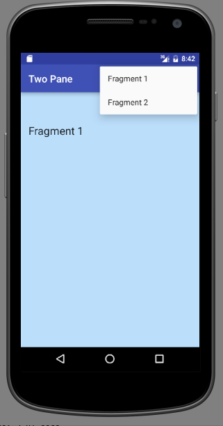

#Fragments (menu)

We shall now provide the following features. These, it must be stressed, are purely for test and demonstration purposes and would not feature in production-standard code.

- A menu with options to attach either of Fragment 1 and Fragment 2.
- The necessary Java code to implement the menu selection. 

##Menu
Create a menu directory in res. Within this create a file `menu_twopane.xml` with the following content:

```
<menu xmlns:android="http://schemas.android.com/apk/res/android"
      xmlns:tools="http://schemas.android.com/tools"
      xmlns:app="http://schemas.android.com/apk/res-auto"
      tools:context="org.wit.myrent.ResidenceActivity">

  <item
      android:id="@+id/fragment_1"
      android:orderInCategory="100"
      app:showAsAction="never"
      android:title="@string/fragment_1"/>

  <item
      android:id="@+id/fragment_2"
      android:orderInCategory="100"
      app:showAsAction="never"
      android:title="@string/fragment_2"/>

</menu>
```
Add the referenced strings in the strings.xml file:

```
  <string name="fragment_1">Fragment 1</string>
  <string name="fragment_2">Fragment 2</string>

```

Override onCreateOptionsMenu in MainActivity:

```
  @Override
  public boolean onCreateOptionsMenu(Menu menu) {
    MenuInflater inflater = getMenuInflater();
    inflater.inflate(R.menu.menu_twopane, menu);
    // return true so that the menu pop up is opened
    return true;
  }
```
Override onOptionsItemSelected, also in MainActivity.

```
  @Override
  public boolean onOptionsItemSelected(MenuItem item) {
    switch (item.getItemId()) {
      case R.id.fragment_1:
        
        Log.d("Twopane", "Fragment 1 attaching");
        return true;
      case R.id.fragment_2:
        
        Log.d("Twopane", "Fragment 2 attaching");
        return true;
      default:
        return super.onOptionsItemSelected(item);
    }
  }
```
These import statements will be required:

```
import android.util.Log;
import android.view.Menu;
import android.view.MenuInflater;
import android.view.MenuItem;
```
Build and run the app. Exercise the menus. Check the logcat pane and verify the log messages in onOptionsItemSelected are displayed.


