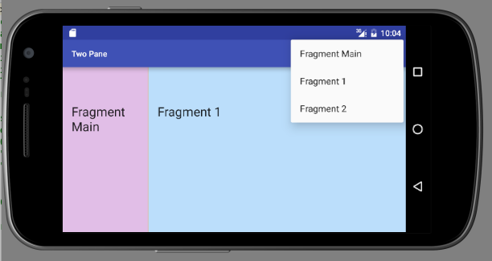

#Master-Detail pattern

We now implement the master-detail pattern in landscape mode. In portrait mode, no change in the functionality of the app should be apparent.

This requires the introduction of the following:

- A landscape version of `activity_fragment_container.xml`. This will be located in a new folder named `layout-land` and contain two FrameLayout elements, one for the new fragment (Fragment Main), the other for the particular fragment chosen by the menu selection (Fragment 1 or Fragment 2). 
- A third fragment to represent the view on the left side of the screen (Fragment Main).

This new feature is illustrated in Figure 1. The menu item Fragment Main is not required in landscape mode. It is left as an exercise to hide this option.



This is the `res/layout-land/activity_fragment_container.xml` file. Observe that it contains two framelayouts. Note the first framelayout (+id/fragmentContainer) is intended for the left-hand fragment in the landscape 2-fragment pane.

```
<?xml version="1.0" encoding="utf-8"?>
<LinearLayout xmlns:android="http://schemas.android.com/apk/res/android"
              android:layout_width="match_parent"
              android:layout_height="match_parent"
              android:divider="?android:attr/dividerHorizontal"
              android:showDividers="middle"
              android:background="@color/orange200"
              android:orientation="horizontal">

  <FrameLayout xmlns:android="http://schemas.android.com/apk/res/android"
               android:id="@+id/fragmentContainer"
               android:layout_width="0dp"
               android:layout_height="match_parent"
               android:layout_weight="1"/>
  <FrameLayout
      android:id="@+id/detailFragmentContainer"
      android:layout_width="0dp"
      android:layout_height="match_parent"
      android:layout_weight="3" />
</LinearLayout>
```

Refactor MainActivity as follows.

First, we require a means of determining whether the application is in portrait or landscape mode. A number of approaches are possible. Our approach is to obtain the current width and height of the screen in pixels. If the width is less than the height then the screen is in portrait mode. 
```
  /**
   * Determines screen orientation by examining screen width and height
   * If the width is less than the height then the orientation is portrait.
   *
   * @return The screen orientation, portrait (1) or landscape (2).
   */
  public int screenOrientation() {
    DisplayMetrics dm = getApplicationContext().getResources().getDisplayMetrics();
    int w = dm.widthPixels;
    int h = dm.heightPixels;
    return w < h ? Configuration.ORIENTATION_PORTRAIT : Configuration.ORIENTATION_LANDSCAPE;

  }
```

The above code requires these import statements:

```
import android.content.res.Configuration;
import android.util.DisplayMetrics;

```

Create a FragmentManager field. We make this choice because we will be using fragment manager repeatedly.

```
  FragmentManager fragmentManager;
```
In `onCreate` initialize fragmentManager:

```
    fragmentManager = getSupportFragmentManager();
```

In the interest of conciseness create two constants to represent portrait and landscape modes:

```
  public static final int PORTRAIT = Configuration.ORIENTATION_PORTRAIT;
  public static final int LANDSCAPE = Configuration.ORIENTATION_LANDSCAPE;
```

In `onCreate`, following the initialization of fragmentManager, create an if-else block:

```
if (screenOrientation() == PORTRAIT) {

} else { // Orientation is landscape
	
}
```
In the first if-else block attach fragment 1. This is the default display.

```
      Fragment fragment = fragmentManager.findFragmentById(R.id.detailFragmentContainer);
      if (fragment == null) {
        fragment = new Fragment_1();
        fragmentManager.beginTransaction().add(R.id.detailFragmentContainer, fragment).commit();
      }

      Log.d("Twopane", "Orientation: " + screenOrientation());

```

Here is the code for the second block: 

``` 
      // attach Fragment 1 to the right frame
      Fragment fragment = fragmentManager.findFragmentById(R.id.detailFragmentContainer);
      if (fragment == null) {
        fragment = new Fragment_1();
        fragmentManager.beginTransaction()
            .add(R.id.detailFragmentContainer, fragment)
            .commit();
      }

      // attach Fragment Main to the left frame
      fragment = fragmentManager.findFragmentById(R.id.fragmentContainer);
      if(fragment == null) {
        fragment = new Fragment_main();
        fragmentManager.beginTransaction()
            .add(R.id.fragmentContainer, fragment)
            .commit();
      }
      Log.d("Twopane", "Orientation: " + screenOrientation());
    }
```


For reference, here is the complete class. Errors will be generated. These will be resolved in the next step.

```
package ie.wit.twopane;

import android.content.res.Configuration;
import android.support.v4.app.Fragment;
import android.support.v4.app.FragmentManager;
import android.support.v4.app.FragmentTransaction;
import android.support.v7.app.ActionBar;
import android.support.v7.app.AppCompatActivity;
import android.os.Bundle;
import android.util.DisplayMetrics;
import android.util.Log;
import android.view.Menu;
import android.view.MenuInflater;
import android.view.MenuItem;

public class MainActivity extends AppCompatActivity
{
  public static final int PORTRAIT = Configuration.ORIENTATION_PORTRAIT;
  public static final int LANDSCAPE = Configuration.ORIENTATION_LANDSCAPE;

  ActionBar actionBar;
  FragmentManager fragmentManager;

  public void onCreate(Bundle savedInstanceState) {
    super.onCreate(savedInstanceState);

    setContentView(R.layout.activity_fragment_container);

    actionBar = getSupportActionBar();

    fragmentManager = getSupportFragmentManager();

    // In the case of portrait any of three fragments may be attached to single activity
    if (screenOrientation() == PORTRAIT) {
      Fragment fragment = fragmentManager.findFragmentById(R.id.detailFragmentContainer);
      if (fragment == null) {
        fragment = new Fragment_1();
        fragmentManager.beginTransaction().add(R.id.detailFragmentContainer, fragment).commit();
      }

      Log.d("Twopane", "Orientation: " + screenOrientation());
    } else { // Orientation is landscape
      // In this mode a 2-pane master-detail screen is presented.
      // Fragment_main is attached to the left pane.
      // Any of the three fragments may be attached to the right pane.
      // It would be simple to prevent Fragment_main attaching to right pane.
      // See: http://stackoverflow.com/questions/10692755/how-do-i-hide-a-menu-item-in-the-actionbar
      Fragment fragment = fragmentManager.findFragmentById(R.id.detailFragmentContainer);
      if (fragment == null) {
        fragment = new Fragment_1();
        fragmentManager.beginTransaction()
            .add(R.id.detailFragmentContainer, fragment)
            .commit();
      }

      fragment = fragmentManager.findFragmentById(R.id.fragmentContainer);
      if(fragment == null) {
        fragment = new Fragment_main();
        fragmentManager.beginTransaction()
            .add(R.id.fragmentContainer, fragment)
            .commit();
      }
      Log.d("Twopane", "Orientation: " + screenOrientation());
    }
  }


  private void swapFragments(Fragment replacementFragment) {
    FragmentTransaction transaction = fragmentManager.beginTransaction();

    // Replace whatever is in the fragment_container view with this fragment,
    // and add the transaction to the back stack (back button will work in addition to menu).
    transaction.replace(R.id.detailFragmentContainer, replacementFragment);
    transaction.addToBackStack(null);

    // Commit the transaction
    transaction.commit();
  }

  @Override
  public boolean onCreateOptionsMenu(Menu menu) {
    MenuInflater inflater = getMenuInflater();
    inflater.inflate(R.menu.menu_twopane, menu);
    // return true so that the menu pop up is opened
    return true;
  }

  @Override
  public boolean onOptionsItemSelected(MenuItem item) {
    switch (item.getItemId()) {

      case R.id.fragment_main:
        swapFragments(new Fragment_main());
        Log.d("Twopane", "Fragment Main attaching");
        return true;

      case R.id.fragment_1:
        swapFragments(new Fragment_1());
        Log.d("Twopane", "Fragment 1 attaching");
        return true;
      case R.id.fragment_2:
        swapFragments(new Fragment_2());
        Log.d("Twopane", "Fragment 2 attaching");
        return true;
      default:
        return super.onOptionsItemSelected(item);
    }
  }

  /**
   * Determines screen orientation by examining screen width and height
   * If the width is less than the height then the orientation is portrait.
   *
   * @return The screen orientation, portrait (1) or landscape (2).
   */
  public int screenOrientation() {
    DisplayMetrics dm = getApplicationContext().getResources().getDisplayMetrics();
    int w = dm.widthPixels;
    int h = dm.heightPixels;
    return w < h ? Configuration.ORIENTATION_PORTRAIT : Configuration.ORIENTATION_LANDSCAPE;

  }

}
```


