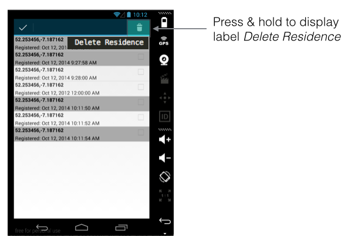

#Resources (Contextual Menu)

Continue building the MyRent app that you developed in the previous lab.

This string resource is required:

```
  <string name="delete_residence">Delete Residence</string>
```

Add a new context menu resource.

Filename: res/menu/residence_list_context.xml

```
<menu
  xmlns:android="http://schemas.android.com/apk/res/android">
    <item android:id="@+id/menu_item_delete_residence"
    android:icon="@android:drawable/ic_menu_delete"
    android:title="@string/delete_residence" />
</menu>

```

We would like the selected residences to appear highlighted for ease of identification. 

- Create a new folder (directory) in *res* named `drawable`.

Add the following xml file to *drawable*:

Filename: res/drawable/background_activated.xml
```
<?xml version="1.0" encoding="utf-8"?>
<selector xmlns:android="http://schemas.android.com/apk/res/android" >
  <item
    android:state_activated="true"
    android:drawable="@android:color/darker_gray"
    />
</selector>

```

Activate the *background_activated* state by adding the following attribute to res/layout/list_item_residence.xml.

- Failure to introduce this line of code will result in selected residence in the list remaining highlighted only as long as the mouse button is pressed.

```
    android:background="@drawable/background_activated"
```

Here is the complete file:

Filename: list_item_residence.xml

```
<RelativeLayout xmlns:android="http://schemas.android.com/apk/res/android"
    android:layout_width="match_parent"
    android:layout_height="match_parent"
    android:background="@drawable/background_activated"
    android:orientation="vertical">

    <CheckBox
        android:id="@+id/residence_list_item_isrented"
        android:layout_width="wrap_content"
        android:layout_height="wrap_content"
        android:gravity="center"
        android:layout_alignParentRight="true"
        android:enabled="false"
        android:focusable="false"
        android:padding="4dp"
         />

    <TextView
        android:id="@+id/residence_list_item_geolocation"
        android:layout_width="match_parent"
        android:layout_height="wrap_content"
        android:layout_toLeftOf="@id/residence_list_item_isrented"
        android:textStyle="bold"
        android:paddingLeft="4dp"
        android:paddingRight="4dp"
        />

    <TextView
        android:id="@+id/residence_list_item_dateTextView"
        android:layout_width="match_parent"
        android:layout_height="wrap_content"
        android:layout_below="@id/residence_list_item_geolocation"
        android:layout_toLeftOf="@id/residence_list_item_isrented"
        android:paddingLeft="4dp"
        android:paddingRight="4dp"
        android:paddingTop="4dp"/>

</RelativeLayout>
```
Implement step 3 before attempting to launch the contextual action bar.

