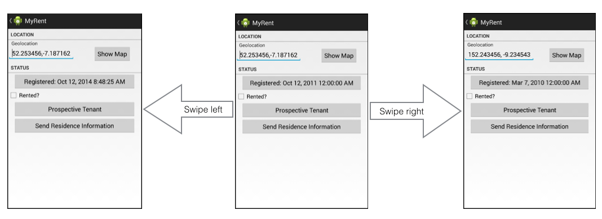
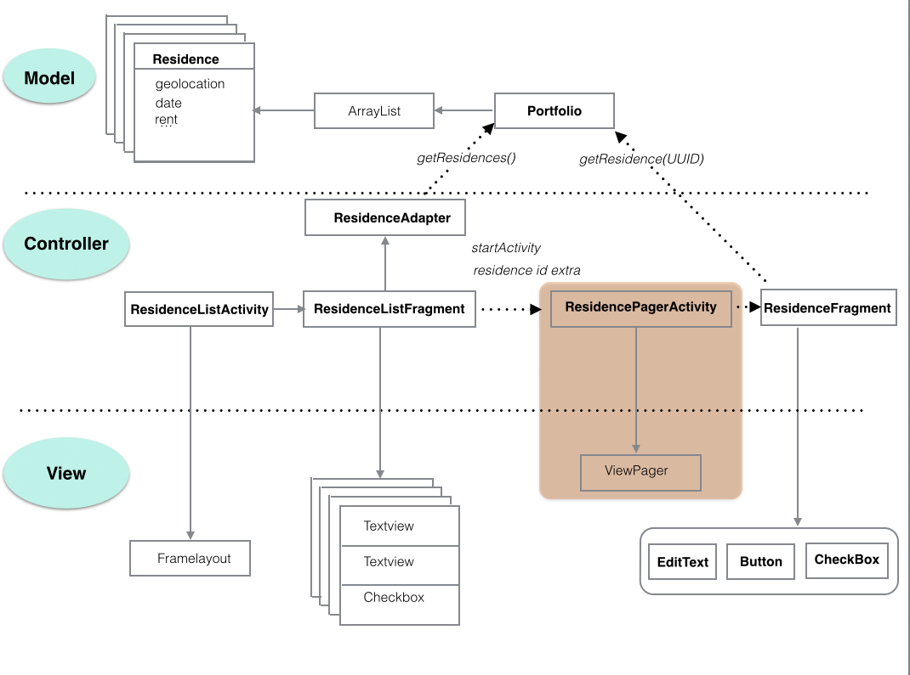

#ViewPager

Continue building MyRent from the end of the previous lab.

Here we shall refactor MyRent by incorporating a ViewPager.

- This will allow us to swipe between pages as illustrated in Figure 1.

The refactoring is shown in Figure 2 where the changes are highlighted: compare this object diagram to that in the previous step and you will see that the main change is the replacement of ResidenceActivity with a new class ResidencePagerActivity. 

