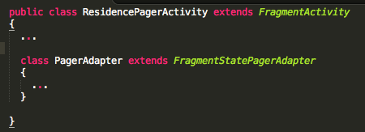

#PagerAdapter

Here we implement the PagerAdapter class. Since it is being used only by ResidencePagerActivity, we shall make it a [nested class](https://docs.oracle.com/javase/tutorial/java/javaOO/nested.html), located as shown here in Figure 1.




```
  class PagerAdapter extends FragmentStatePagerAdapter 
  {
    private ArrayList<Residence>  residences; 
  
    public PagerAdapter(FragmentManager fm, ArrayList<Residence> residences)
    {
      super(fm);
      this.residences = residences;
    }
    
    @Override
    public int getCount()  
    {  
      return residences.size();  
    }
    
    @Override
    public Fragment getItem(int pos) 
    {
      Residence residence = residences.get(pos);
      Bundle args = new Bundle();
      args.putSerializable(ResidenceFragment.EXTRA_RESIDENCE_ID, residence.id);
      ResidenceFragment fragment = new ResidenceFragment();
      fragment.setArguments(args);
      return fragment;
    } 
  }
```
These import statements are required by PageAdapter:

```
import android.support.v4.app.Fragment;
import android.support.v4.app.FragmentManager;
import android.support.v4.app.FragmentStatePagerAdapter;
```

