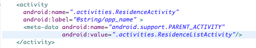
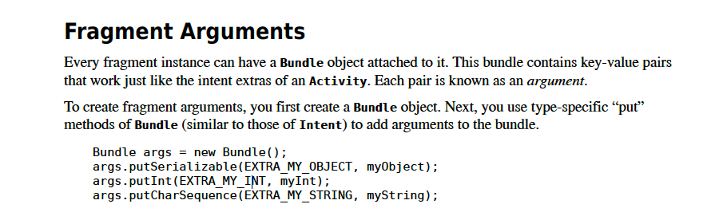

#Resources (ViewPager)

Create a new file *ids.xml* in res/values folder which will be used to store viewPager id numbers:

Filename: ids.xml

```
<resources>
    <item type="id" name="viewPager" />
</resources>

```

Change the ResidenceActivity node in the manifest file to ResidencePagerActivity. This should already be the case if you chose refactoring in the previous step.




```
    <activity 
        android:name=".activities.ResidencePagerActivity"
        android:label="@string/app_name">
            
        <meta-data  
          android:name="android.support.PARENT_ACTIVITY"
          android:value=".activities.ResidenceListActivity"/>
    </activity>
```

<h4>ResidenceFragment</h4>

Replace this line in ResidenceFragment:

```
Long resId  (Long)getActivity().getIntent().getSerializableExtre(EXTRA_RESIDENCE_ID);
```

with this:

```
Long resId = (Long)getArguments().getSerializable(EXTRA_RESIDENCE_ID);
```
This last line of code extracts the current residence id from the Bundle object that was created in the *PagerAdapter.getItem* method which is located in the file ResidencePagerActivity. 

- There we added a fragment argument to the Bundle object. The value of this argument is the current residence id.
- See here for a brief summary of fragment arguments taken from the Android Book by Hardy & Philips:



