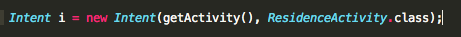

#Integrate ResidencePagerActivity

To date in ResidenceListActivity.onListItemClick:

- When a list item is clicked the ResidenceActivity is started.

We now wish to start ResidencePagerActivity:

- To do so, in ResidenceListFragment, replace the following code:



with this:

```
Intent i = new Intent(getActivity(), ResidencePagerActivity.class);
```
In ResidenceListFragment, replace any other references to ResidenceActivity with ResidencePagerActivity.

Note that if you choose refactoring in step-03 then the name changes should already have taken place.


Test the app at this stage: the swipe feature should be available. In particular conduct the following checks:

- Create three residences, assigning different latitudes to each so as to easiy distinguish between them.
- In the residence list click on each item in turn and verify that the correct detail view is displayed.
- Exercise the swipe feature both left and right horizontally. 
- To swipe on an emulator click and hold down the left mouse button on any detail view and then more the mouse left or right. Should you have difficulty doing so on an emulator, try it on a physical device.
