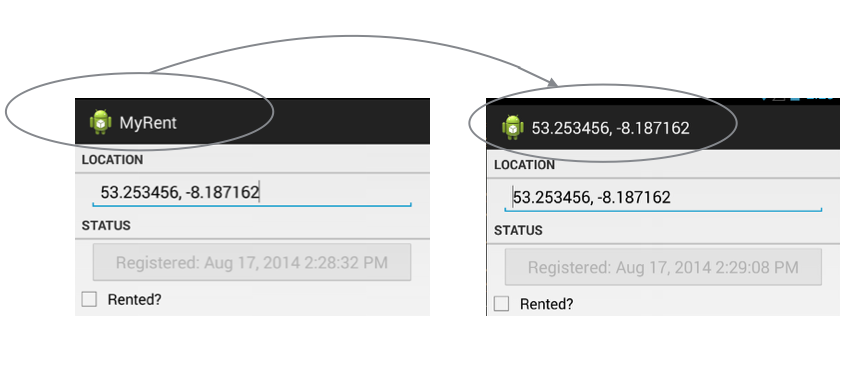

#Listener

The code implemented in the previous steps is sufficient to allow detailed residence pages to be swiped left and right. The following instructions show how you can intervene when a new page is displayed and perform some other tasks. Soley for demonstration purposes we choose to change the label in the action bar to display the geolocation rather than the application name. Here is how it's done.

Change the signature of ResidencePagerActivity so as to implement [ViewPager.OnPageChangeListener](https://developer.android.com/reference/android/support/v4/view/ViewPager.OnPageChangeListener.html):

```
public class ResidencePagerActivity extends AppCompatActivity implements ViewPager.OnPageChangeListener

```

This change requires the implementation of these interface methods:

```

  @Override
  public void onPageScrolled(int position, float positionOffset, int positionOffsetPixels)
  {

  }

  @Override
  public void onPageSelected(int position)
  {

  }

  @Override
  public void onPageScrollStateChanged(int state)
  {

  }
```
We are only interested in full implementation of *onPageScrolled*. Here it is:

```

  @Override
  public void onPageScrolled(int position, float positionOffset, int positionOffsetPixels) {
    info(this, "onPageScrolled: position "+ position +" arg1 "+ positionOffset +" positionOffsetPixels "+ positionOffsetPixels);
    Residence residence = residences.get(position);
    if (residence.geolocation != null)
    {
      setTitle(residence.geolocation);
    }
```
The method *info* is implemented in the helpers folder and may be imported in a similar manner as previously in, for example, ResidenceFragment.

This last feature is illustrated in Figure 1 below.




Register the OnPageListener


```
    viewPager.addOnPageChangeListener(this);

```

Import the info helper:

```
import static org.wit.android.helpers.LogHelpers.info;

```

For reference, these are the imports required. 

- Note that in some cases more than one option is available.

```
import android.os.Bundle;
import android.support.v4.app.Fragment;
import android.support.v4.app.FragmentManager;
import android.support.v4.app.FragmentStatePagerAdapter;
import android.support.v4.view.ViewPager;
import android.support.v7.app.AppCompatActivity;
import org.wit.myrent.R;
import org.wit.myrent.app.MyRentApp;
import org.wit.myrent.models.Portfolio;
import org.wit.myrent.models.Residence;
import java.util.ArrayList;
import static org.wit.android.helpers.LogHelpers.info;
```
Deploy the apk and verify that the action bar now displays the geolocation (latitude-longitude) corresponding to the rendered residence detail view.


