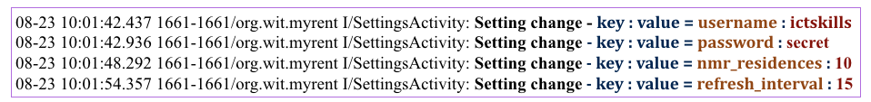

#Settings pane

On launching MyRent the user is presented with the residence list view and it is here we decide to facilitate access to settings. This is illustrated in Figure 1:


The default settings menu item has already been included as shown in Figure 2:


Add a log statement and associated import to SettingsFragment.onSharedPreferenceChanged:

```
import static org.wit.android.helpers.LogHelpers.info;
```

```
 info(getActivity(), "Setting change - key : value = " + key + " : " + sharedPreferences.getString(key, ""));
```
Create a logCat filter as shown in Figure 3.


Build and test by exercising this new menu option. It should be possible to display the settings pane as demonstrated in Figure 1.

Introduce a test value for each of the four items in the settings pane. The output in the logcat pane should include something similar to that shown in Figure 4.



The application at the end of this lab is available for reference here: [myrent-10](https://github.com/wit-ictskills-2016/myrent-10.git)


