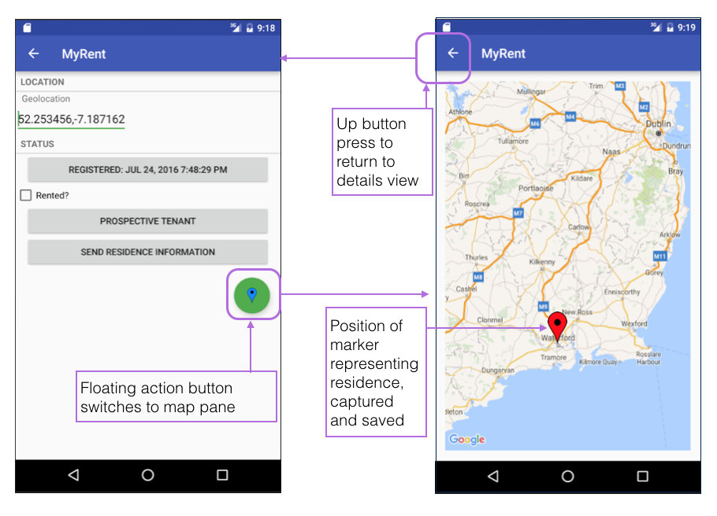

#Preview

Continue building the MyRent app that you developed in the previous lab.

We commence by launching Google Android Map application from within MyRent. Realizing the limitations of this approach, we then proceed to integrated a Google Map into our application and in so doing gain access to its rich application programming interface (API).

This entails using:

- Google Play Services Library,
- A Google API key,
- Create a layout in XML,
- Adding the necessary Java code contained within a customised activity,
- Wiring up the activity so that its functionality can be exploited to capture residences' geolocations.

The map may be launched from within the detailed Residence view where it is bound to the floating action button. The Up button allows a user to return to the residence details view once the geolocation has been determined (by dragging a marker into position). This is illustrated in Figure 1.

 

The instructions in this lab refer to development in *debug mode*. This means that the application you develop will not be suitable to publish on Play. Further information is available about this topic is available [here](http://developer.android.com/tools/publishing/app-signing.html) and [here](http://developer.android.com/distribute/tools/launch-checklist.html ).