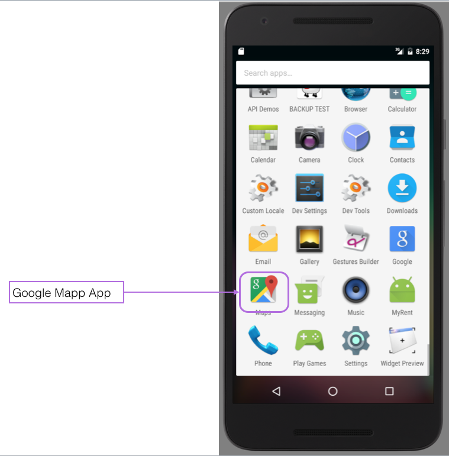
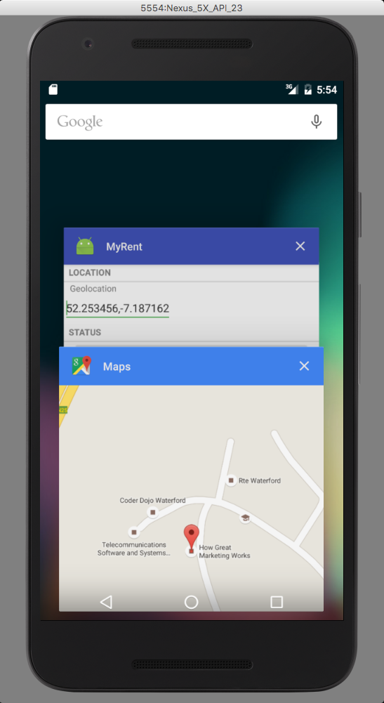

#External Map

This lab comprise two parts. In the first short section we show how to launch an external map application from within MyRent. The second longer lab demonstates how to embed a map within MyRent, expose the map's API and make use of some of its powerful features.




Add the following method to IntentHelper:

```
  public static void openPreferredLocationInMap(Activity parent, String location)
  {
    Uri geoLocation = Uri.parse("geo:0,0?").buildUpon().appendQueryParameter("q", location).build();

    Intent intent = new Intent(Intent.ACTION_VIEW);
    intent.setData(geoLocation);

    if (intent.resolveActivity(parent.getPackageManager()) != null)
    {
      parent.startActivity(intent);
    }
    else
    {
      LogHelpers.info(parent, "Couldn't call " + location + ", no receiving apps installed!");
    }
  } 
```

An import is required for the Uri class:

```
import android.net.Uri;
```

In the above code you will notice that we are using an implicit Intent. 

- This searches for components that are registered for the action we have specified, namely ACTION_VIEW.
- Because of the particular argument we have used in the *Uri.parse* method, the component sought will be one which can display a geolocation. In our case this will be the external maps app that we should already have downloaded onto the emulator or physical device if not already present. See [here](https://developer.android.com/guide/components/intents-common.html) for official documentation.


Invoke this helper method from within ResidenceFragment by pressing the *floating action button*.

Here is the code snippet to facilitate this. It should be added to ResidenceFragment:

Import the floating action button:

```
  import android.support.design.widget.FloatingActionButton;

  
```

Initialize a local floating action button variable in the *onCreateView* method and register a listener callback.

```
FloatingActionButton fab = (FloatingActionButton) v.findViewById(R.id.fab);
fab.setOnClickListener(this);

```


Intercept and handle a click on the button in the existing *onClick(...)* method:

```
      case R.id.fab : 
      IntentHelper.openPreferredLocationInMap(getActivity(), residence.geolocation);
        break;

```

Add the fab button xml at the end of layout/fragment_residence.xml:

```
  <android.support.design.widget.FloatingActionButton
      android:id="@+id/fab"
      android:layout_width="wrap_content"
      android:layout_height="wrap_content"
      android:layout_gravity="bottom|end"
      android:layout_margin="@dimen/fab_margin"
      android:src="@drawable/ic_blue_marker"/>
```

Provide an additional attribute 

```

xmlns:app="http://schemas.android.com/apk/res-auto"
```

to the root fragment_residence.xml LinearLayout node which now becomes:

```
<LinearLayout xmlns:android="http://schemas.android.com/apk/res/android"
              android:layout_width="match_parent"
              android:layout_height="match_parent"
              xmlns:app="http://schemas.android.com/apk/res-auto"
              android:orientation="vertical">

```
The above is discussed in this StackOverflow article: [What is the 'app' Android XML namespace](http://stackoverflow.com/questions/26692233/what-is-the-app-android-xml-namespace).

Add the marker icon [ic_blue_marker.png](archive/ic_blue_marker.png) to the *drawable* folder. This becomes part of the floating action button and is referenced in the above xml button code.

Create (or replace) res/values/colors.xml with the following content:

```
<?xml version="1.0" encoding="utf-8"?>
<resources>
  <color name="colorPrimary">#3F51B5</color>
  <color name="colorPrimaryDark">#303F9F</color>
  <color name="colorAccent">#4CAF50</color>
</resources>
```

Use was made of the [material palette](https://www.materialpalette.com/) in arriving at this color selection.

This element should be present in the file res/values/dimens.xml:

```
  <dimen name="fab_margin">16dp</dimen>
```

Ensure that build.gradle contains this dependency:

```
  compile 'com.android.support:design:23.4.0'

```

Test this feature by building and running the app. Create a new residence. Click on the floating action button. The Google Map should launch (Figure 2). 

In the next step we shall expose the Google map API and use it to capture a residence's geolocation (latitude - longitude).


