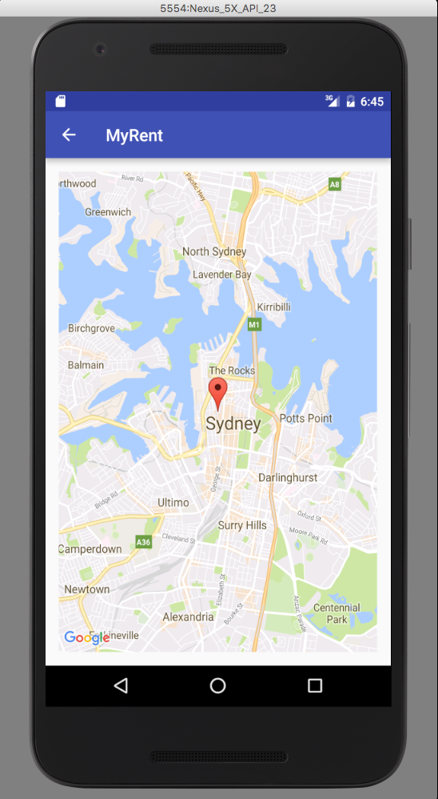

#API Key

Obtain an API key. How to do so is explained in detail in the Appendix at the end of this lab.

One could insert one's key directly into the manifest file. However, this would necessitate changing the manifest were different keys required for production and debug builds. Instead we shall use gradle to inject the key at build time.

Add the following snippet to your build.gradle (Module.app). Remember there are two build.gradle files. Ensure you configure the correct one.

```
buildTypes {
    release {
      minifyEnabled false
      proguardFiles getDefaultProguardFile('proguard-android.txt'), 'proguard-rules.pro'
      manifestPlaceholders = [ google_map_key:"Your Key Here"]
    }
    debug {
      manifestPlaceholders = [ google_map_key:"Your Key Here"]
    }
```

This dependency is required:

```
  compile 'com.google.android.gms:play-services:9.4.0'
```

Add this xml to the manifest file before the closing application tag:


```

<application ...>
   ...
   ...

    <!--Google MAP API key placeholder (keys in build.gradle)-->
    <meta-data
        android:name="com.google.android.maps.v2.API_KEY"
        android:value="${google_map_key}"/>
</application>

```
The android:value placeholder (google_map_key) will be replaced at build time with the correct key chosen from the build.gradle file.

Build and run MyRent. Create a new residence and using the floating action button switch to map view. You should be presented with something similar to that shown in Figure 1.



For reference, here is a sample build.gradle:

```
apply plugin: 'com.android.application'

android {
  compileSdkVersion 23
  buildToolsVersion "23.0.3"

  defaultConfig {
    applicationId "org.wit.myrent"
    minSdkVersion 19
    targetSdkVersion 23
    versionCode 1
    versionName "1.0"
  }
  buildTypes {
    release {
      minifyEnabled false
      proguardFiles getDefaultProguardFile('proguard-android.txt'), 'proguard-rules.pro'
      manifestPlaceholders = [google_map_key: "AIxxxxxxxxxxxxxxxxxxxxxxxx"]
    }
    debug {
      manifestPlaceholders = [google_map_key: "AAIxxxxxxxxxxxxxxxxxxxxxxxx"]
      debuggable true
    }
  }

  dependencies {
    compile fileTree(dir: 'libs', include: ['*.jar'])
    testCompile 'junit:junit:4.12'
    compile 'com.android.support:appcompat-v7:23.4.0'
    compile 'com.android.support:design:23.4.0'
    compile 'com.google.android.gms:play-services:9.4.0'

  }

```