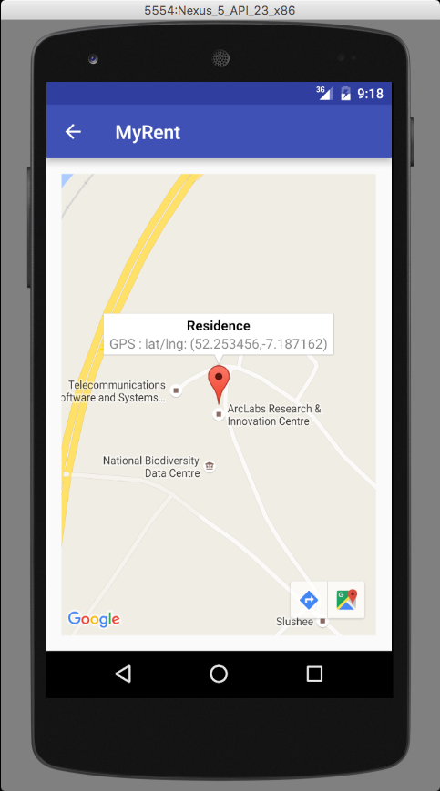

#MapActivity (Continued)

We are now in a position to finalize implementation of onMapReady. It remains to:

- Position the marker to represent the current residence's location by replacing 
`LatLng latLng = MapHelper.latLng(...` as follows:

```
  LatLng latLng = MapHelper.latLng(this, residence.geolocation);
  MarkerOptions options = new MarkerOptions()
    .title("Residence")
    .snippet("GPS : " + latLng.toString())
    .draggable(true)
    .position(latLng);

```

- Ensure that the zoom level is saved.  In onMapReady we retrieve the zoom level from the persistent storage and apply this level to the map:

```
  map.moveCamera(CameraUpdateFactory.newLatLngZoom(latLng, (float)residence.zoom));
```

- To ensure that if the zoom level is changed without dragging the marker it is necessary to implement the     GoogleMap.OnCameraIdleListener listener, register it in onMapReady and implement the single interface method `onCameraIdle()` as follows:

```
public class MapActivity extends AppCompatActivity
    implements OnMapReadyCallback,
    GoogleMap.OnMarkerDragListener,
    GoogleMap.OnInfoWindowClickListener,
    GoogleMap.OnCameraIdleListener
{
    ...
    ...
  }
```

```
  @Override
  public void onMapReady(GoogleMap map) {
    ...
    ...
        map.setOnCameraIdleListener(this);
    ...
    ...
  }

```

```
  /**
   * GoogleMap.OnCameraIdleListener
   * We implement this interface to capture zoom when marker not dragged but zoom changed
   * example by pinching screen.
   * When google map camera stops moving we capture the zoom and save to model.
   */
  @Override
  public void onCameraIdle() {
    residence.zoom = map.getCameraPosition().zoom;
  }
```

## Implement GoogleMap.OnMarkerClickListener

Finally, to ensure the `infowindow` displays the correct residence geolocation when a marker is clicked, implement OnMarkerClickListener, register it in onMapReady and implement onMarkerClick, all as shown below:

```
public class MapActivity extends AppCompatActivity
    implements OnMapReadyCallback,
    GoogleMap.OnMarkerDragListener,
    GoogleMap.OnInfoWindowClickListener,
    GoogleMap.OnMarkerClickListener {
    ...
    ...
  }
```

```
  @Override
  public void onMapReady(GoogleMap map) {
    ...
    map.setOnMarkerClickListener(this);
    ...
  }
```

```
  /**
   * The purpose of including this method is to update the info window information
   * with the geolocation of the current position of the marker.
   * @param marker The marker whose info window being refreshed
   * @return Returns false indicating default behaviour, i.e. open info window.
   */
  @Override
  public boolean onMarkerClick(Marker marker) {
    LatLng latLng = MapHelper.latLng(this, residence.geolocation);
    marker.setSnippet("GPS : " + latLng.toString());
    return false;
  }
  ```

Build run and test the application.

- Create a new residence.
- Switch to the map view.
- Verify the info window displays a geolation matching that in the residence details view.
- Drag the marker to a new location.
- Verify the info window geolocation changes to correspond to the new marker position.
- Change the map zoom level.
- Note the marker geolocation and then use the up button to switch to the residence details view.
- Verify the geolocation in the textview here matches that noted down from the map.
- Shut down the app (do not delete).
- Reopen map and verify the residence characteristics have been correctly saved and retrieved.



Note that it is possible to prevent the soft keyboard opening automatically on launching an activity y using this attribute:

```
android:windowSoftInputMode="stateHidden|adjustResize"
```

In the case of ResidencePagerActivity its inclusion might typically result in the following:

```
    <activity
        android:name=".activities.ResidencePagerActivity"
        android:windowSoftInputMode="stateHidden|adjustResize"
        android:label="@string/app_name" >
      <meta-data android:name="android.support.PARENT_ACTIVITY"
                 android:value=".activities.ResidenceListActivity"/>
    </activity>

```

For reference, here is the completed MapActivity class:

```

package org.wit.myrent.activities;

import android.support.v7.app.AppCompatActivity;
import android.os.Bundle;
import android.view.MenuItem;

import com.google.android.gms.maps.*;
import com.google.android.gms.maps.model.*;

import org.wit.myrent.R;

import static org.wit.android.helpers.IntentHelper.navigateUp;

import org.wit.android.helpers.MapHelper;
import org.wit.myrent.app.MyRentApp;
import org.wit.myrent.models.Residence;

public class MapActivity extends AppCompatActivity
    implements OnMapReadyCallback,
    GoogleMap.OnMarkerDragListener,
    GoogleMap.OnInfoWindowClickListener,
    GoogleMap.OnCameraIdleListener,
    GoogleMap.OnMarkerClickListener
{

  /*
 * We use the current residence when navigating back to parent class - ResidenceFragment as
 * this is required in ResidenceFragment onCreate. The navigateUp
 */
  Long resId;

  Residence residence; // The residence associated with this map pane
  MyRentApp app;
  GoogleMap map;

  @Override
  protected void onCreate(Bundle savedInstanceState) {
    super.onCreate(savedInstanceState);
    setContentView(R.layout.activity_map);

    MapFragment mapFragment = (MapFragment) getFragmentManager()
        .findFragmentById(R.id.map);
    mapFragment.getMapAsync(this);

    resId = (Long)getIntent().getSerializableExtra(ResidenceFragment.EXTRA_RESIDENCE_ID);

    app = (MyRentApp)getApplication();
    residence = app.portfolio.getResidence(resId);

  }

  @Override
  public void onMapReady(GoogleMap map) {
    this.map = map;

    map.setOnMarkerDragListener(this);
    map.setOnInfoWindowClickListener(this);
    map.setOnMarkerClickListener(this);
    map.setOnCameraIdleListener(this);

    LatLng latLng = MapHelper.latLng(this, residence.geolocation);
    MarkerOptions options = new MarkerOptions()
        .title("Residence")
        .snippet("GPS : " + latLng.toString())
        .draggable(true)
        .position(latLng);

    map.addMarker(options);

    map.moveCamera(CameraUpdateFactory.newLatLngZoom(latLng, (float)residence.zoom));

    map.setOnInfoWindowClickListener(this);

  }

  @Override
  public boolean onOptionsItemSelected(MenuItem item)
  {
    switch (item.getItemId())
    {
      case android.R.id.home:
        navigateUp(this, ResidenceFragment.EXTRA_RESIDENCE_ID, resId);
        return true;

      default: return super.onOptionsItemSelected(item);
    }
  }

  /**
   * GoogleMap.OnMarkerDragListener
   * @param marker
   */
  @Override
  public void onMarkerDragStart(Marker marker) {

  }

  /**
   * GoogleMap.OnMarkerDragListener
   * @param marker
   */
  @Override
  public void onMarkerDrag(Marker marker) {

  }

  /**
   * GoogleMap.OnMarkerDragListener
   * When marker drag ends, save Residence model geolocation and zoom.
   * @param marker The map marker representing current residence geolocation.
   */
  @Override
  public void onMarkerDragEnd(Marker marker) {
    residence.geolocation = MapHelper.latLng(marker.getPosition());
    residence.zoom = map.getCameraPosition().zoom;
    map.animateCamera(CameraUpdateFactory.newLatLng(marker.getPosition()));
  }

  /**
   * GoogleMap.OnInfoWindowClickListener
   * Click an open infowindow to close it.
   * Click on a marker to open an infowindow
   * @param marker The marker associated with this infowindow.
   */
  @Override
  public void onInfoWindowClick(Marker marker) {
    marker.hideInfoWindow();
  }

  /**
   * GoogleMap.OnMarkerClickListener
   * The purpose of including this method is to update the info window information
   * with the geolocation of the current position of the marker.
   * @param marker The marker whose info window being refreshed
   * @return Returns false indicating default behaviour, i.e. open info window.
   */
  @Override
  public boolean onMarkerClick(Marker marker) {
    LatLng latLng = MapHelper.latLng(this, residence.geolocation);
    marker.setSnippet("GPS : " + latLng.toString());
    return false;
  }

  /**
   * GoogleMap.OnCameraIdleListener
   * We implement this interface to capture zoom when marker not dragged but zoom changed
   * example by pinching screen.
   * When google map camera stops moving we capture the zoom and save to model.
   */
  @Override
  public void onCameraIdle() {
    residence.zoom = map.getCameraPosition().zoom;
  }
}

```

The application at the end of this lab is available for reference here: [myrent-11](https://github.com/wit-ictskills-2016/myrent-11.git)
