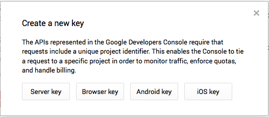

#API Key

We recommend that you become familiar with the official documentation for [Google Maps Android API v2](https://developers.google.com/maps/documentation/android/start#overview).

It is necessary to obtain an API key before using the Google Maps API. This can be achieved as follows:

- Retrieve your SHA-1 Fingerprint
    - A SHA-1 fingerprint is a unique text string required by Google Maps to identify your application.
    - One easy way of obtaining the SHA-1 fingerprint associated with your machine is to create a new default project in Android Studio in which you create a Google Maps Activity. See Figure 1.
        - The fingerprint is then available in the file *google_maps_api.xml* as shown in Figure 2.
    - A second method of obtaining the fingerprint is to access the app's signing report as shown in Figure 3. This is described in detail in the stackoverflow article [How to get the SHA-1 fingerprint certificate in Android Studio for debug mode?](http://stackoverflow.com/questions/27609442/how-to-get-the-sha-1-fingerprint-certificate-in-android-studio-for-debug-mode).

- Register a Google account (or use an existing one) and sign in.
- Open the [Google API Console](https://cloud.google.com/console)
    - Create a project named, for example, *myrent* (Figures 4 & 5).

- Select Credentials in the Projects column and press the *Create new key* button (Figure 6).

- The *Create a new key* window opens: press the *Android key* button (Figure 7).

- A window similar to that illustrated in Figure 6 now opens:
    - Paste the SHA-1 Fingerprint into the the area indicated, followed by a semi-colon, followed by the project package name.
    - Example: 45:B8:A9:...DE;org.wit.myrent
    - Press the Create button.

- A window showing the key and other relevant information should then appear as shown in Figure 9.

- Switch on Google Maps Android API v2
    - Select APIS & AUTH and then APIs in the left-hand Projects column  scroll to Google Maps Android API v2
    - The button on the right should be off: if so, press it to turn it ON (Figure 10).

Here is a summary of the data that should be retained securely:

- The login | password pair for the Google account
- The SHA-1 fingerprint
- The API keys

You may use the same key if you build MyRent on a different computer. However, it will be necessary to obtain the SHA-1 fingerprint for that device and add the package name and SHA-1 certificate fingerprint to your credentials console. An example is shown in Figure 11.

