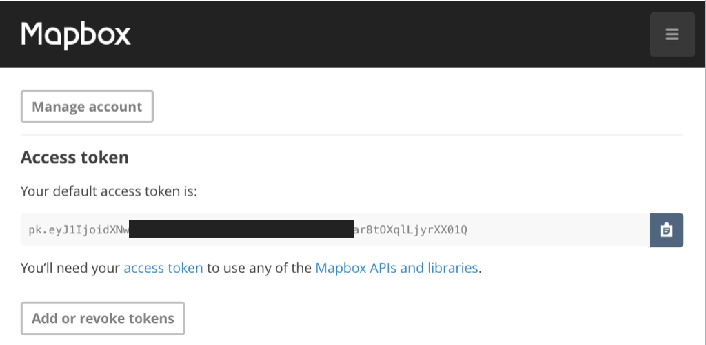

#Introduction

In a previous lab our MyRent app consumed a GoogleMap API. Here we provide an alternative mapping system provided by MapBox. This is based on the open source OpenStreetMap project. This approach is interesting for a number of reasons. We are not obliged to undergo the somewhat laborious process of obtaining keys. For our purposes a simple token suffices. The API provided by MapBox is quite easy to use. And the method reference count in the signed release build for this iteration of MyRent is significantly less than that generated when using GoogleMaps. For example, presently, the MyRent release apk breaches the 64k method reference limit whereas using MapBox results in a method reference count in the order of 42k.

[OpenStreetMap (OSM)](https://en.wikipedia.org/wiki/OpenStreetMap) is an open source project to create a free editable world map. The project was founded by Stev Coast in 2004 and has experienced growing usage. According to the referenced Wikipedia article, presently there are over two million registered users. 

The OSM licence was originally published under the Creative Commons Attribution-ShareAlike licence but has since changed to the Open Database Licence (ODbL).

The approach taken in this lab is to continue from the end of the previous lab and replace GoogleMap with the MapBox version. It is suggested that you provide suitable tags or branches to facilite recovery of the Google Maps state should you require.

Before proceeding, create an account (free - no credit card required) with [MapBox](https://www.mapbox.com/). 

- Once registered, switch to the [studio page](https://www.mapbox.com/studio/) and copy your default access token. This will be required in a later step.

