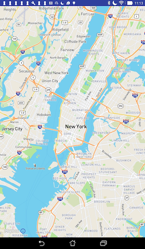

#MapBox activity

Add an activity MapBoxActivity to the activities package, locating your token in the placeholder `your token`.

```
package org.wit.myrent.activities;

import android.app.Activity;
import android.os.Bundle;

import com.mapbox.mapboxsdk.maps.MapView;
import com.mapbox.mapboxsdk.maps.MapboxMap;
import com.mapbox.mapboxsdk.maps.OnMapReadyCallback;
import com.mapbox.mapboxsdk.MapboxAccountManager;

import org.wit.myrent.R;

public class MapBoxActivity extends Activity {

  private MapView mapView;

  
  @Override
  protected void onCreate(Bundle savedInstanceState) {
    super.onCreate(savedInstanceState);

    // Mapbox access token only needs to be configured once in your app
    MapboxAccountManager.start(this, "your token");

    // This contains the MapView in XML and needs to be called after the account manager
    setContentView(R.layout.activity_mapbox);


    mapView = (MapView) findViewById(R.id.mapView);
    mapView.onCreate(savedInstanceState);
    mapView.getMapAsync(new OnMapReadyCallback() {
      @Override
      public void onMapReady(MapboxMap mapboxMap) {

        // Customize map with markers, polylines, etc.

      }
    });
  }

  // Add the mapView lifecycle to the activity's lifecycle methods
  @Override
  public void onResume() {
    super.onResume();
    mapView.onResume();
  }

  @Override
  public void onPause() {
    super.onPause();
    mapView.onPause();
  }

  @Override
  public void onLowMemory() {
    super.onLowMemory();
    mapView.onLowMemory();
  }

  @Override
  protected void onDestroy() {
    super.onDestroy();
    mapView.onDestroy();
  }

  @Override
  protected void onSaveInstanceState(Bundle outState) {
    super.onSaveInstanceState(outState);
    mapView.onSaveInstanceState(outState);
  }
}
```

##Manifest

Delete the MapActivity node.

These permissions are required.

```
  <uses-permission android:name="android.permission.ACCESS_NETWORK_STATE" />
  <uses-permission android:name="android.permission.ACCESS_COARSE_LOCATION" />
  <uses-permission android:name="android.permission.ACCESS_FINE_LOCATION" />
  <uses-permission android:name="android.permission.READ_CONTACTS" />
  <uses-permission android:name="android.permission.INTERNET" />

```

Add a MapBoxActivity node:

```
    <activity
        android:name=".activities.MapBoxActivity"
        android:label="@string/app_name">
    <meta-data android:name="android.support.PARENT_ACTIVITY"
               android:value=".activities.ResidencePagerActivity"/>
    </activity>

```

Add telemetry service:
```
        <service android:name="com.mapbox.mapboxsdk.telemetry.TelemetryService" />

```

##ResidenceFragment

In ResidenceFragment.onClick replace the code relating to the now deleted Google map activity with the following:

```

      case R.id.fab:
        //startActivityWithData(getActivity(), MapActivity.class, EXTRA_RESIDENCE_ID, residence.id); // <--- delete this line
        startActivityWithData(getActivity(), MapBoxActivity.class, EXTRA_RESIDENCE_ID, residence.id);
        break;
```

Build, install apk on a device or emulator. Open a residence detail view and click on the floating action button. You should be presented with the default MapBox map as shown in Figure 1.




