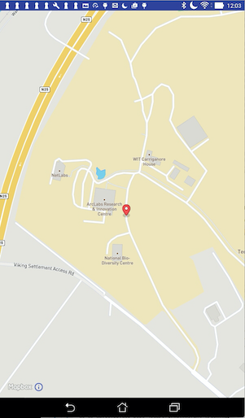

#Residence geolocation

To centre the map on the residence geolocation requires the following steps:

- Obtain the current residence id from the fragment bundle.
- Use the id to obtain a reference to the residence and thence its geolocation.
- Centre the map on this geolocation.

We are about to make several additions in this step. To avoid a proliferation of errors it is best to add all the necessary imports now:

```
import android.support.annotation.NonNull;

import com.mapbox.mapboxsdk.annotations.MarkerViewOptions;
import com.mapbox.mapboxsdk.camera.CameraPosition;
import com.mapbox.mapboxsdk.camera.CameraUpdateFactory;
import com.mapbox.mapboxsdk.geometry.LatLng;

import org.wit.android.helpers.MapHelper;
import org.wit.myrent.app.MyRentApp;
import org.wit.myrent.models.Residence;

```
Introduce these fields:

```
  private MapboxMap mapboxMap;
  Long resId; // The id of the residence associate with this map pane
  Residence residence; // The residence associated with this map pane
  LatLng residenceLatLng;
  MyRentApp app;
```

In `onCreate initialize `resId`, `residence` and `residenceLatLng`:

```

    resId = (Long) getIntent().getSerializableExtra(ResidenceFragment.EXTRA_RESIDENCE_ID);
    app = (MyRentApp) getApplication();
    residence = app.portfolio.getResidence(resId);
    if (residence != null) {
      residenceLatLng = new LatLng(MapHelper.latitude(residence.geolocation),
          MapHelper.longitude(residence.geolocation));
    }

```

Create a private method `setMarker`. This instantiates a marker and adds it to the map.

```

  private void setMarker() {

    MarkerViewOptions marker = new MarkerViewOptions().position(residenceLatLng);
    mapboxMap.addMarker(marker);
  }

```

Create a private method to position the map camera. This method uses the `residenceLatLng` reference together with the incoming residence zoom value in positioning the camera.

```

  private void positionCamera() {
    CameraPosition position = new CameraPosition.Builder()
        .target(residenceLatLng) // Sets the new camera position
        .zoom(residence.zoom) // Sets the zoom
        .build(); // Creates a CameraPosition from the builder

    mapboxMap.animateCamera(CameraUpdateFactory
        .newCameraPosition(position));
  }

```
We are now in a position to implement the customization to `onMapReady`:

```
  // OnMapReadyCallback interface method impl
  @Override
  public void onMapReady(MapboxMap mapboxMap) {
    this.mapboxMap = mapboxMap;
    positionCamera();
    setMarker();
  }
```
Test the app as before. The output should now resemble that in Figure 1.

