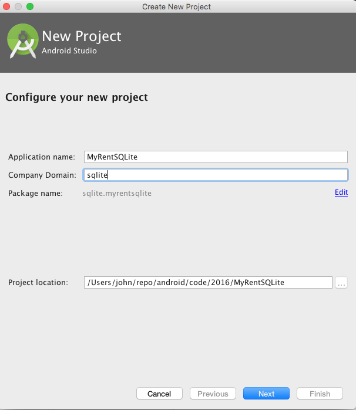
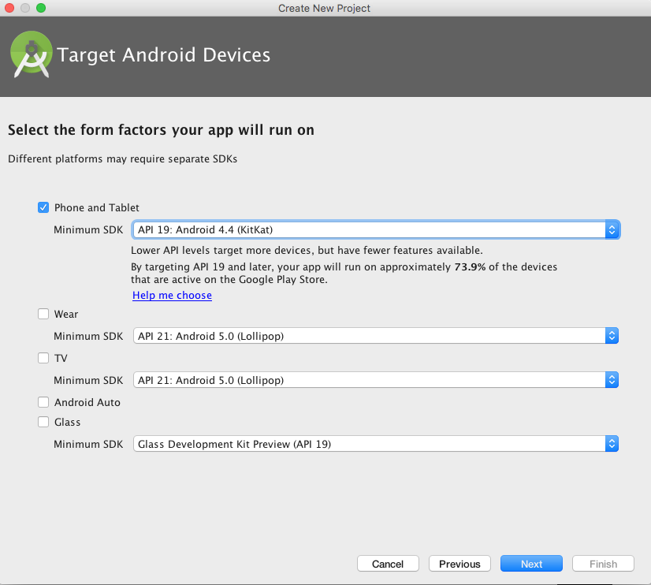
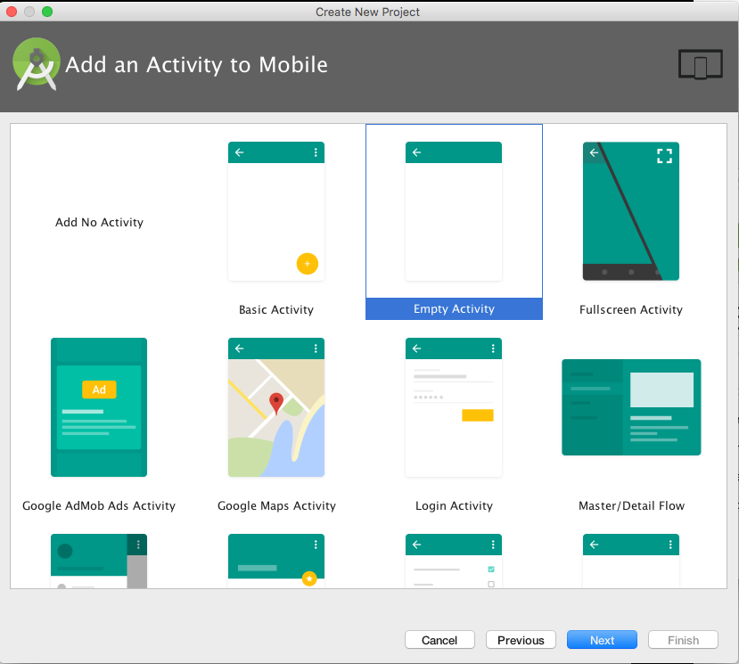
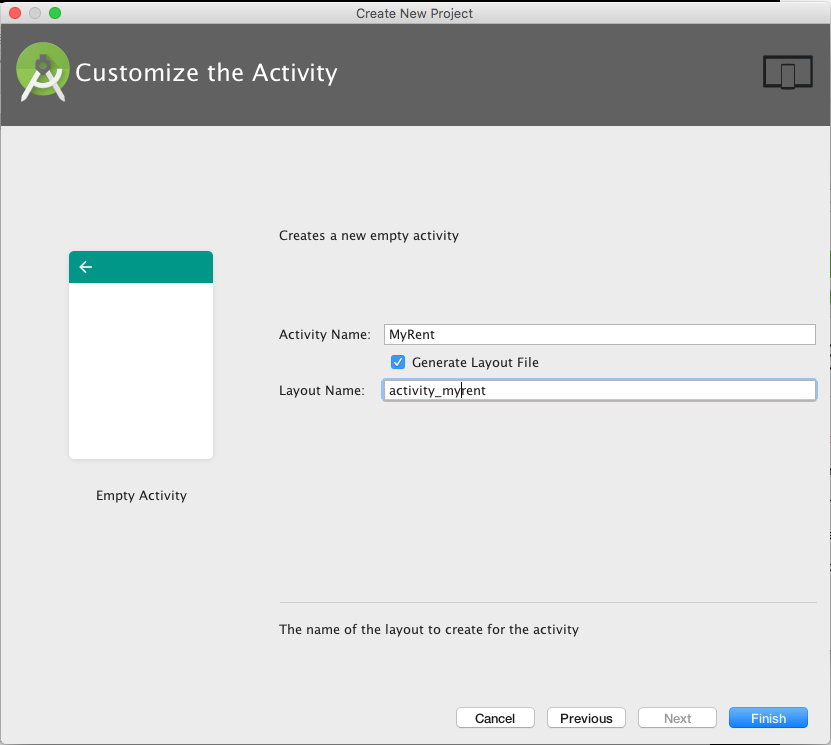
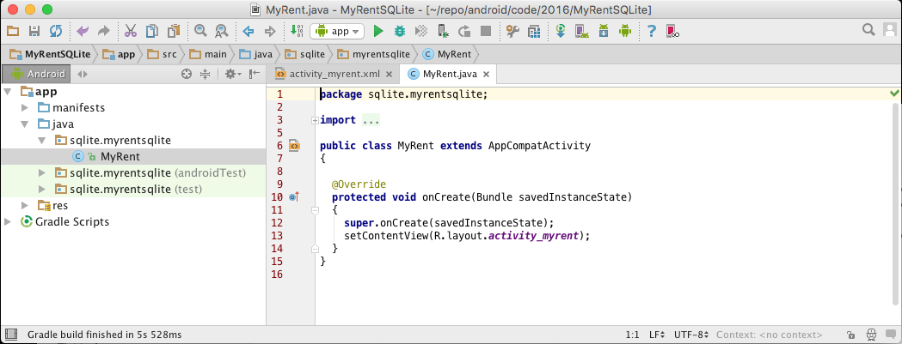
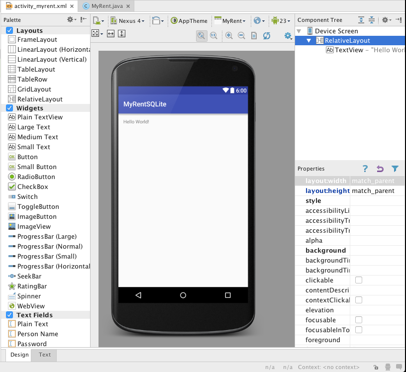

#Baseline app

Create a baseline app named MyRentSQLite and complete the wizard screesn, following the steps shown in the following figures 1 to 4.

On completing the wizard, the app opens within Android Studio. This is shown in Figures 6 and 6.










Replace build.gradle (Module:app) with the following version to align with the Android configuration we have been using in this course:

```
apply plugin: 'com.android.application'

android {
  compileSdkVersion 23
  buildToolsVersion "23.0.3"

  defaultConfig {
    applicationId "sqlite.myrentsqlite"
    minSdkVersion 19
    targetSdkVersion 23
    versionCode 1
    versionName "1.0"
  }
  buildTypes {
    release {
      minifyEnabled false
      proguardFiles getDefaultProguardFile('proguard-android.txt'), 'proguard-rules.pro'
    }
  }
}

dependencies {
  compile fileTree(dir: 'libs', include: ['*.jar'])
  testCompile 'junit:junit:4.12'
  compile 'com.android.support:appcompat-v7:23.4.0'
}

```
Build and install apk on a device or emulator to display the standard hello world screen as shown in Figure 6.