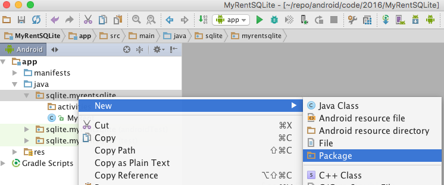
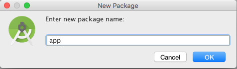
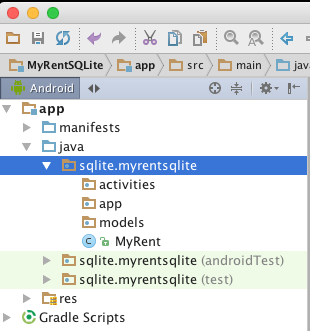

#Project structure

To closely mimic the MyRent app structure, create three packages, *activities*, *app* and *models* as shown in the following pictures:

Move MyRent.java into the activities package. Unfortunately there is a bug in Android Studio 2.1.1 that cause the IDE to freeze if one attempts to drag and drop. 
This appears to have been resolved in version 2.1.3 but if not then simply copy and paste the file into activities and delete it from its original location.

We shall progressively implement the following features:

We begin with a restricted version of the Residence model class. It contains only 2 fields.

1. Add a Residence object to the database.
2. Delete a single Residence object from the database.
3. Delete all Residence objects in the database.
4. Obtain a list of all Residence objects in the database.
5. Obtain a single nominated Residence object from the database.
6. Add all remaining fields to the Residence model and test previously added features.
7. Implement an update feature whereby an existing Residence object in the database may have some or all of its fields modified, excluding the primary key.

We will then have implemented Create, Read, Update and Delete (CRUD) capabilities.

Note: not all import statements are included in the code provided. Code completion hints are generally provided that simplifies this task.