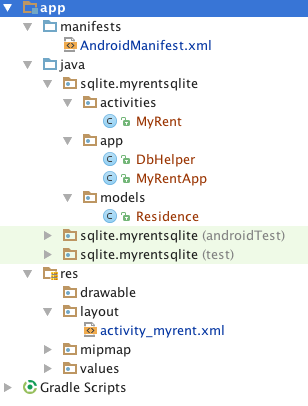
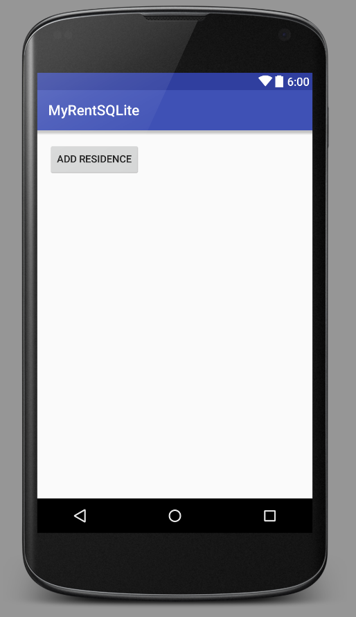

#Add Residence

We will build the app incrementally, beginning with the adding of a single Residence object to the database. 

The refactoring comprises:

- Adding a button to the layout which when clicked causes a Residence object to be added to the database.
- Adding an event handler and other code to the activity MyRent to respond to a button click.
- Subclassing the Android Application class with a new class MyRentApp, located in the app package.
- Making changes to the AndroidManifest file to reflect the subclassing of the Application class.
- Subclassing the SQLiteOpenHelper class with a new class DbHelper, located in the app package.
- Adding a Residence model class that contains, for now, just two fields - the primary key and another.

The project structure, following refactoring, is depicted in Figure 1.



##Manifest file

Here is the AndroidManifest.xml text. We have added the application name as an attribute (`.app.MyRentApp`).

```
<?xml version="1.0" encoding="utf-8"?>
<manifest package="sqlite.myrentsqlite"
          xmlns:android="http://schemas.android.com/apk/res/android">

  <application
      android:name=".app.MyRentApp"
      android:allowBackup="true"
      android:icon="@mipmap/ic_launcher"
      android:label="@string/app_name"
      android:supportsRtl="true"
      android:theme="@style/AppTheme">
    <activity android:name=".activities.MyRent">
      <intent-filter>
        <action android:name="android.intent.action.MAIN"/>

        <category android:name="android.intent.category.LAUNCHER"/>
      </intent-filter>
    </activity>
  </application>

</manifest>

```

##Layout

The refactored layout file `activity_myrent.xml` , both text and design views follow:

```
<?xml version="1.0" encoding="utf-8"?>
<RelativeLayout
    xmlns:android="http://schemas.android.com/apk/res/android"
    xmlns:tools="http://schemas.android.com/tools"
    android:layout_width="match_parent"
    android:layout_height="match_parent"
    android:paddingBottom="@dimen/activity_vertical_margin"
    android:paddingLeft="@dimen/activity_horizontal_margin"
    android:paddingRight="@dimen/activity_horizontal_margin"
    android:paddingTop="@dimen/activity_vertical_margin"
    tools:context="sqlite.myrentsqlite.activities.MyRent">

  <Button
      android:layout_width="wrap_content"
      android:layout_height="wrap_content"
      android:text="Add Residence"
      android:id="@+id/addResidence"
      android:layout_alignParentLeft="true"
      android:layout_alignParentStart="true"/>

</RelativeLayout>

```


##Model

```
package sqlite.myrentsqlite.models;

import java.util.UUID;

public class Residence
{
  public UUID id;
  public String geolocation;


  public Residence()
  {
    id = UUID.randomUUID();
    geolocation = "52.253456,-7.187162";
  }

}
```

##Application subclass

```
package sqlite.myrentsqlite.app;

import android.app.Application;
import android.util.Log;

public class MyRentApp extends Application
{
  static final String TAG = "MyRentApp";
  public DbHelper dbHelper = null;

  private static MyRentApp app;
  @Override
  public void onCreate()
  {
    super.onCreate();
    dbHelper = new DbHelper(getApplicationContext());
    Log.d(TAG, "MyRent app launched");
    app = this;
  }

  public static MyRentApp getApp(){
    return app;
  }
}
```

##SQLiteOpenHelper subclass

```
package sqlite.myrentsqlite.app;

import android.content.ContentValues;
import android.content.Context;
import android.database.sqlite.SQLiteDatabase;
import android.database.sqlite.SQLiteOpenHelper;
import android.util.Log;
import sqlite.myrentsqlite.models.Residence;

public class DbHelper extends SQLiteOpenHelper
{
  static final String TAG = "DbHelper";
  static final String DATABASE_NAME = "residences.db";
  static final int DATABASE_VERSION = 1;
  static final String TABLE_RESIDENCES = "tableResidences";

  static final String PRIMARY_KEY = "id";
  static final String GEOLOCATION = "geolocation";

  Context context;

  public DbHelper(Context context)
  {
    super(context, DATABASE_NAME, null, DATABASE_VERSION);
    this.context = context;
  }

  @Override
  public void onCreate(SQLiteDatabase db)
  {
    String createTable =
        "CREATE TABLE tableResidences " +
        "(id text primary key, " +
        "geolocation text)";

    db.execSQL(createTable);
    Log.d(TAG, "DbHelper.onCreated: " + createTable);
  }

  /**
   * @param residence Reference to Residence object to be added to database
   */
  public void addResidence(Residence residence)
  {
    SQLiteDatabase db = this.getWritableDatabase();
    ContentValues values = new ContentValues();
    values.put(PRIMARY_KEY, residence.id.toString());
    values.put(GEOLOCATION, residence.geolocation);
    // Insert record
    db.insert(TABLE_RESIDENCES, null, values);
    db.close();
  }


  @Override
  public void onUpgrade(SQLiteDatabase db, int oldVersion, int newVersion)
  {
    db.execSQL("drop table if exists " + TABLE_RESIDENCES);
    Log.d(TAG, "onUpdated");
    onCreate(db);
  }
}
```
##Activity

```
package sqlite.myrentsqlite.activities;

import android.os.Bundle;
import android.support.v7.app.AppCompatActivity;
import android.view.View;
import android.widget.Button;

import sqlite.myrentsqlite.R;
import sqlite.myrentsqlite.app.MyRentApp;
import sqlite.myrentsqlite.models.Residence;

public class MyRent extends AppCompatActivity implements View.OnClickListener
{

  private Button addResidence;

  MyRentApp app;
  Residence residence;

  @Override
  protected void onCreate(Bundle savedInstanceState)
  {
    super.onCreate(savedInstanceState);
    setContentView(R.layout.activity_myrent);

    app = MyRentApp.getApp();

    addResidence = (Button) findViewById(R.id.addResidence);
    addResidence.setOnClickListener(this);
  }

  @Override
  public void onClick(View v)
  {
    switch (v.getId())
    {
      case R.id.addResidence:
        addResidence();
        break;

    }
  }

  private void addResidence()
  {
    residence = new Residence();

    app.dbHelper.addResidence(residence);

  }
}
```
