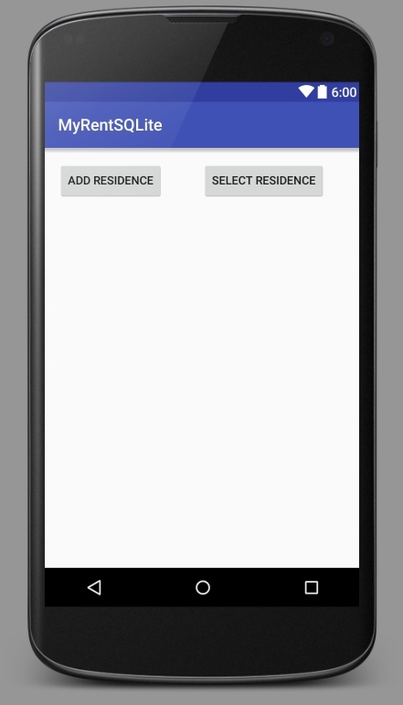

#Select a Residence

In this step, we provide the additional code to select a single residence from the database.

##Layout (xml)

Add a *Delete Residence* button to the layout:

```
  <Button
      android:layout_width="wrap_content"
      android:layout_height="wrap_content"
      android:text="Select Residence"
      android:id="@+id/selectResidence"
      android:layout_alignBottom="@+id/addResidence"
      android:layout_alignParentEnd="true"
      android:layout_marginEnd="27dp"/>

```


##DbHelper

Add this method to DbHelper.java:

```
  public Residence selectResidence(UUID resId) {
    Residence residence;
    SQLiteDatabase db = this.getReadableDatabase();
    Cursor cursor = null;

    try {
      residence = new Residence();

      cursor = db.rawQuery("SELECT * FROM tableResidences WHERE id = ?", new String[]{resId.toString() + ""});

      if (cursor.getCount() > 0) {
        int columnIndex = 0;
        cursor.moveToFirst();
        residence.id = UUID.fromString(cursor.getString(columnIndex++));
        residence.geolocation = cursor.getString(columnIndex++);
      }
    } finally {
      cursor.close();
    }
    return residence;
  }
```
These import statements are required:

```
import android.content.ContentValues;
import android.content.Context;
import android.database.Cursor;
```

##MyRent (activity)

The following additional code snippets are required:

- A Button field.
- Binding of the button resource in the R file to the new button field.
- Setting a listener on the button.
- Intercepting a button click.
- Implementing a method *selectResidence* that in turn invokes DbHelper.deleteResidence.

Here are the code snippets:

```
  private Button selectResidence;

```

```
    selectResidence = (Button) findViewById(R.id.selectResidence);
    selectResidence.setOnClickListener(this);
```

```

      case R.id.selectResidence:
        selectResidence();
        break;

```

```
  /**
   * This method demonstrates how to select a Residence record, identified by
   * its primary key, the UUID field.
   * Invoking addResidence() writes a Residence record to the database.
   * Additionally, it initializes this.residence field.
   * The id of this.residence is then used as a parameter in DbHelper.selectResidence.
   */
  public void selectResidence()
  {
    addResidence();
    UUID uuid = residence.id;
    Residence selectedResidence = app.dbHelper.selectResidence(uuid);
    if (residence != null && residence.id.toString().equals(selectedResidence.id.toString()))
    {
      Toast.makeText(this, "Residence record selected(id: " + residence.id, Toast.LENGTH_LONG).show();
    }
    else
    {
      Toast.makeText(this, "Failed to select Residence record", Toast.LENGTH_LONG).show();
    }
  }
```

Toast and UUID imports are required:

```
import android.widget.Toast;
import java.util.UUID;
```