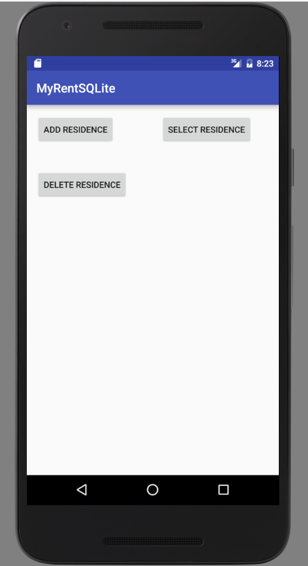

#Delete a Residence

In this step, we provide the additional code to delete a single residence from the database.

##Layout (xml)

Add a *Delete Residence* button to the layout:

```
  <Button
      android:layout_width="wrap_content"
      android:layout_height="wrap_content"
      android:text="Delete Residence"
      android:id="@+id/deleteResidence"
      android:layout_below="@+id/addResidence"
      android:layout_alignParentStart="true"
      android:layout_marginTop="42dp"/>
```


##DbHelper

Add this method to DbHelper.java:

```
    public void deleteResidence(Residence residence) {
        SQLiteDatabase db = this.getWritableDatabase();
        try {
            db.delete("tableResidences", "id" + "=?", new String[]{residence.id.toString() + ""});
        } catch (Exception e) {
            Log.d(TAG, "delete residence failure: " + e.getMessage());
        }
    }
```

##MyRent (activity)

The following additional items are required:

- A Button field.
- Binding of the button resource in the R file to the new button field.
- Setting a listener on the button.
- Intercepting a button click.
- Implementing a method *deleteResidence* that in turn invokes DbHelper.deleteResidence.

Here are the code snippets:

```
  private Button deleteResidence;

```

```
    deleteResidence = (Button) findViewById(R.id.deleteResidence);
    deleteResidence.setOnClickListener(this);
```

```
@Override
  public void onClick(View v)
  {
    switch (v.getId())
    {

      ...
      ...

      case R.id.deleteResidence:
        deleteResidence();
        break;

    }

  }

```
```
  public void deleteResidence()
  {
    if (residence == null)
    {
      addResidence();
    }
    else {
      Residence res = app.dbHelper.selectResidence(residence.id);
      app.dbHelper.deleteResidence(res);
    }
  }
```


Debug into the app and using adb or otherwise verify that this feature works correctly.