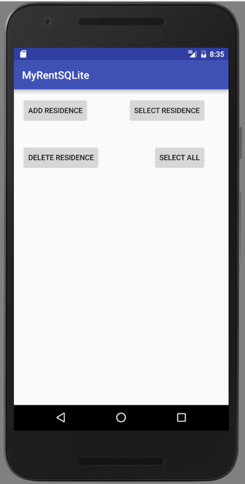

#List all residences

In this step we shall select the entire tableResidences record set and store in a List array.

##Layout (xml)

```
  <Button
      android:id="@+id/selectAllResidences"
      android:layout_width="wrap_content"
      android:layout_height="wrap_content"
      android:layout_alignBottom="@+id/deleteResidence"
      android:layout_alignEnd="@+id/selectResidence"
      android:text="Select All"/>
```


##DbHelper

```
  /**
   * Query database and select entire tableResidences.
   * 
   * @return A list of Residence object records
   */
  public List<Residence> selectAllResidences() {
    List<Residence> residences = new ArrayList<Residence>();
    String query = "SELECT * FROM " + "tableResidences";
    SQLiteDatabase db = this.getWritableDatabase();
    Cursor cursor = db.rawQuery(query, null);
    if (cursor.moveToFirst()) {
      int columnIndex = 0;
      do {
        Residence residence = new Residence();
        residence.id = UUID.fromString(cursor.getString(columnIndex++));
        residence.geolocation = cursor.getString(columnIndex++);

        columnIndex = 0;

        residences.add(residence);
      } while (cursor.moveToNext());
    }
    cursor.close();
    return residences;
  }
```


##MyRent (activity)

```
  private Button selectAllResidences;
```

```
    selectAllResidences = (Button) findViewById(R.id.selectAllResidences);
    selectAllResidences.setOnClickListener(this);
```

```
      case R.id.selectAllResidences:
        selectAllResidences();
        break;
```

```
  public void selectAllResidences() {
    List<Residence> residences = app.dbHelper.selectAllResidences();
    Toast.makeText(this, "Retrieved residence list containing  " + residences.size() + " records", Toast.LENGTH_LONG).show();
  }
```

Import the List class:

```
import java.util.List;

```

Debug into the app to verify that this feature works correctly.


