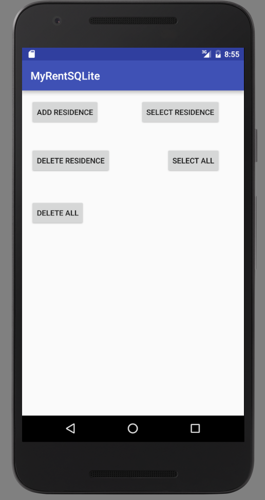

#Delete all

In this step we shall delete the entire tableResidences record set.

##Layout (xml)

```

  <Button
      android:id="@+id/deleteAllResidences"
      android:layout_width="wrap_content"
      android:layout_height="wrap_content"
      android:layout_marginTop="49dp"
      android:text="Delete All"
      android:layout_below="@+id/deleteResidence"
      android:layout_alignParentStart="true"/>

```


##DbHelper

```
  /**
   * Delete all records
   */
  public void deleteAllResidences() {
    SQLiteDatabase db = this.getWritableDatabase();
    try {
      db.execSQL("delete from tableResidences");
    } catch (Exception e) {
      Log.d(TAG, "delete residences failure: " + e.getMessage());
    }
  }

```
Add a method to obtain the number of rows in the database:

```
  /**
   * Queries the database for the number of records.
   *
   * @return The number of records in the dataabase.
   */
  public long getCount() {
    SQLiteDatabase db = this.getReadableDatabase();
    long numberRecords  = DatabaseUtils.queryNumEntries(db, TABLE_RESIDENCES);
    db.close();
    return numberRecords;
  }

```
Required import:

```
import android.database.DatabaseUtils;


```

##MyRent (activity)

```
  private Button deleteAllResidences;

```

```
    deleteAllResidences = (Button) findViewById(R.id.deleteAllResidences);
    deleteAllResidences.setOnClickListener(this);


```

```
      case R.id.deleteAllResidences:
        deleteAllResidences();
        break;

```

```
  /**
   * Delete all records.
   * Count the number of rows in database following deletion -should be zero.
   * Provide user feed back in a toast.
   */
  public void deleteAllResidences() {
    app.dbHelper.deleteAllResidences();
    Toast.makeText(this, "Number of records in database " + app.dbHelper.getCount(), Toast.LENGTH_LONG).show();

  }

```
