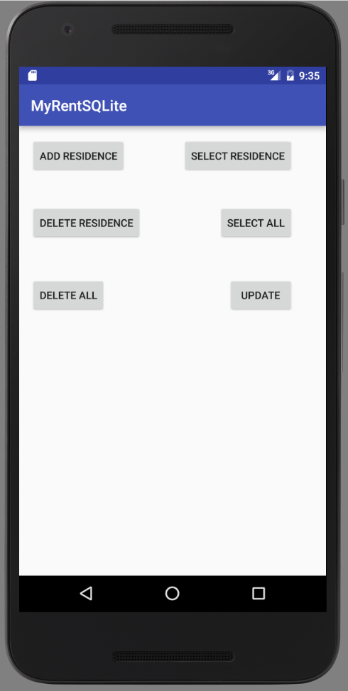

#Update

In this the final step we shall update a tableResidences record - a Residence object.

##Layout (xml)


```
  <Button
      android:id="@+id/updateResidence"
      android:layout_width="wrap_content"
      android:layout_height="wrap_content"
      android:text="Update"
      android:layout_alignTop="@+id/deleteAllResidences"
      android:layout_alignEnd="@+id/selectAllResidences"/>
```



##DbHelper

```
  /**
   * Update an existing Residence record.
   * All fields except record id updated.
   * 
   * @param residence The Residence record being updated.     
   */
  public void updateResidence(Residence residence) {
    SQLiteDatabase db = this.getWritableDatabase();
    try {
      ContentValues values = new ContentValues();
      values.put(GEOLOCATION, residence.geolocation);
      values.put(DATE, String.valueOf(residence.date.getTime()));
      values.put(RENTED, residence.rented == true ? "yes" : "no");
      values.put(TENANT, residence.tenant);
      values.put(ZOOM, Double.toString(residence.zoom));
      values.put(PHOTO, residence.photo);
      db.update("tableResidences", values, "id" + "=?",  new String[]{residence.id.toString() + ""});
    } catch (Exception e) {
      Log.d(TAG, "update residences failure: " + e.getMessage());
    }
  }

```

##MyRent (activity)

```

  private Button updateResidence;


```


```
    updateResidence = (Button) findViewById(R.id.updateResidence);
    updateResidence.setOnClickListener(this);
```

```
      case R.id.updateResidence:
        updateResidence();
        break;
```

```
  /**
   * Update a residence record.
   * Create and insert a test record.
   * Make some changes to its fields and update its copy in the database.
   * Verify and provide toast feedback.
   */
  public void updateResidence() {
    addResidence(); // This initializes the instance variable Residence residence
    Residence res = app.dbHelper.selectResidence(residence.id);
    // Makes some distinguishing changes to res fields
    res.tenant = "Barney Gumble";
    res.rented = true;
    res.zoom = 20;

    app.dbHelper.updateResidence(res);

    // Read the updated rrow and verify it's correct.
    Residence res2 = app.dbHelper.selectResidence(res.id);
    boolean b = res.zoom == res2.zoom;
    if (b == true) {
      Toast.makeText(this, "Update succeeded", Toast.LENGTH_LONG).show();
    }
    else {
      Toast.makeText(this, "Update failed", Toast.LENGTH_LONG).show();
    }
  }
```

A completed version of the application is available to download from GitHub: [MyRentSQLite](https://github.com/wit-ictskills-2016/myrent-sqlite.git)

