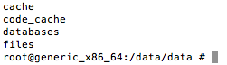

#Android Debug Bridge (adb)

**adb** is a commandline tool to view and manipulate SQlite databases generated within an Android app.

Here is the link for official Android documentation: [Android Debug Bridge](https://developer.android.com/studio/command-line/adb.html)

In this step we will:

- very briefly describe how modify the path environment variable on your computer (Mac & Windows) by adding the path to the *Android Debug Bridge* utility (*adb*).

- outline how to manually delete the database data using *adb*

**Add Android Debug Bridge to the PATH variable**

- On the Mac (OSX)

The *Android Debug Bridge (adb)* is located in the platform-tools folder in the ADT bundle.

It is necessary to insert the path to *adb* on the PATH environment variable.

The path to this utility might be something like the following (amend appropriately for your particular environment):

```
$HOME/android-dev/adt-bundle-mac-x86_64-20130729/sdk/platform-tools

```

In OSX this can be added to the PATH variable by editing the .bash_profile file which is located in the home folder. Quoting from, for example, [OSX Mountain Lion support page](http://support.apple.com/kb/PH10939) :

In Windows 10, a typical path to adb.exe is as follows:

```
C:\Users\User\AppData\Local\Android\sdk\platform-tools

```

*The home folder stores your documents, preference settings, and other information. A home folder is created for each user of your computer when his or her account is set up. If you are the only user of your computer, there is only one home folder. The home folder isn’t actually named “Home”; its name is the same as the account name specified in your user account. Your home folder appears in the sidebar of Finder windows.*

See also [OSX El Capitan: home folder](https://support.apple.com/kb/PH22031?locale=en_US).

Open a terminal window. Check that you are in the home folder. Use *Sublime Text* editor to open .bash_profile*

The first line of the modified path could be this:

PATH=\$PATH:/\$HOME/android-dev/adt-bundle-mac-x86_64-20130729/sdk/platform-tools:\\

- On Windows

On Windows you may edit the path by accessing

*System Properties > Advanced > Environment Variables*


**Using adb**

In a terminal window execute

*adb shell*

This will change the command prompt to *root@generic:/ ... *.

Change directory:

*cd data/data*

Type *ls sqlite.myrentsqlite.

You should see something like that shown in Figure 1 :




To remove the database execute

*rm -rf sqlite.myrentsqlite/databases*

It's important to note that the name of the folder containg the database, *sqlite.myrentsqlite* , derives from the package name in the AndroidManifest.xml file and that the name of the database, *residences.db*, is that which we have assigned in DbHelper.java. The table, *tableResidences*, will also have been assigned in DbHelper.
