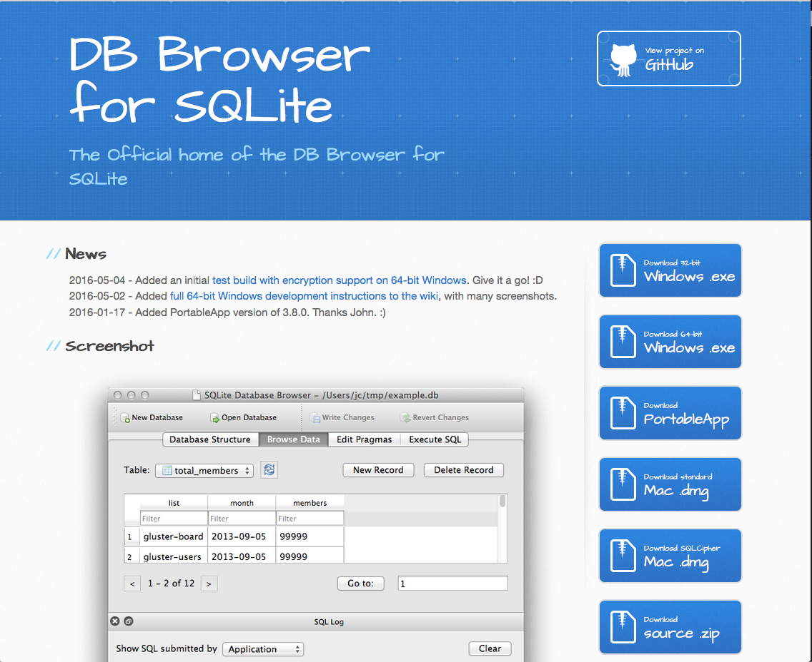
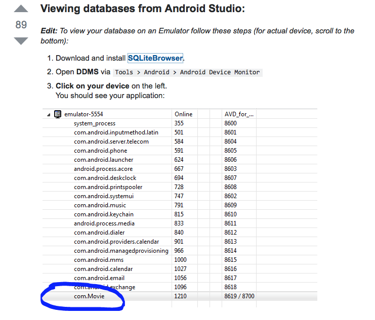
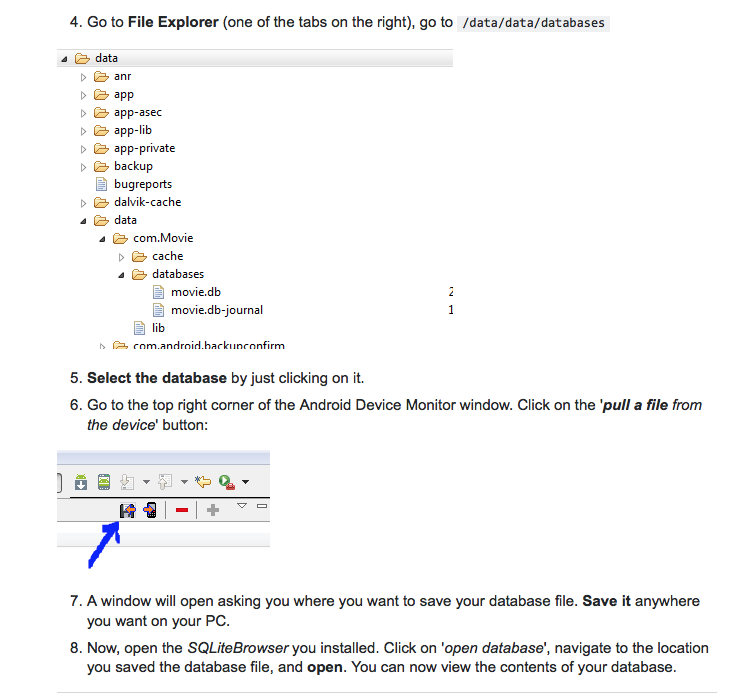
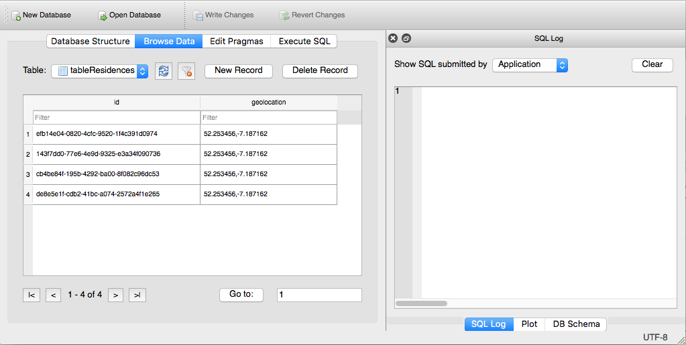

#SQLite Browser

A third-party [SQLite browser](http://sqlitebrowser.org/) provides an alternative approach to *adb* to view the database content.

Detailed information on the installation and use of the browser is contained in the *stackoverflow* article [View contents of database file in Android Studio](http://stackoverflow.com/questions/17529766/view-contents-of-database-file-in-android-studio), summarized in the the following screenshots:

