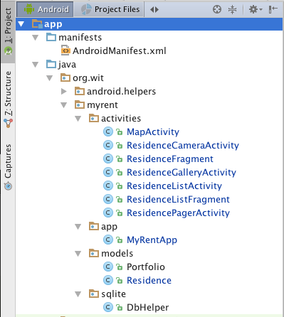

#App

The project structure, showing the packages you should create, is shown here in Figure 1.



In MyRentApp delete the PortfolioSerializer field and associated code. Also, delete the PortfolioSerializer file.

Observe that we have changed the signature of the Portfolio constructor, removing the serializer object and replacing it with the application context. This generates an error that will be resolved when we later refactor Portfolio.

Here is the refactored class. 

```

package org.wit.myrent.app;

import android.app.Application;
import android.util.Log;
import org.wit.myrent.models.Portfolio;


public class MyRentApp extends Application
{
  static final String TAG = "MyRentApp";
  public Portfolio portfolio;

  protected static MyRentApp app;
  @Override
  public void onCreate()
  {
    super.onCreate();
    portfolio = new Portfolio(getApplicationContext());
    Log.d(TAG, "MyRent app launched");
    app = this;
  }

  public static MyRentApp getApp(){
    return app;
  }
}

```