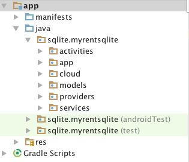

#Project organization

##Packages
Refactor the *sqlite.myrentsqlite* packaging as shown in Figure 1.



Locate the files as follows:

- activities: MyRent
- app: MyRentApp
- models: Residence
- providers: DbHelper

At this point both *services* and *cloud* packages are empty.

##Constants

We shall follow best practice, move the constants from the DbHelper class and locate them in a separate class *ResidenceContract* located in the *providers* package.

We have encountered most of the constants in the SQLite lab. The additional constants such as AUTHORITY, CONTENT_URI and so on, relate to implementing ContentProvider. 

Much of this module has been influenced by Chapter 11 from [Learning Android, 2nd Edition](http://shop.oreilly.com/product/0636920023456.do) where, for example, detailed explanations are provided on the roles of the various constants. We deal with these also in the accompanying presentation. 

```
package sqlite.myrentsqlite.providers;

import android.net.Uri;
import android.provider.BaseColumns;

/**
 * Created by jfitzgerald on 18/07/2016.
 */
public class ResidenceContract
{
  // Database specific constants

  static final String TAG = "ResidenceContract";
  static final String DATABASE_NAME = "residences.db";
  static final int DATABASE_VERSION = 1;
  static final String TABLE_RESIDENCES = "tableResidences";

  // Provider specific constants
  public static final String AUTHORITY = "sqlite.myrentsqlite.providers.ResidenceProvider";
  public static final Uri CONTENT_URI = Uri.parse("content://" + AUTHORITY + "/" + TABLE_RESIDENCES);
  public static final int RESIDENCE_ITEM = 1;
  public static final int RESIDENCE_DIR = 2;
  public static final String STATUS_TYPE_ITEM = "vnd.android.cursor.item/vnd.sqlite.myrentsqlite.providers.provider.status";
  public static final String STATUS_TYPE_DIR = "vnd.android.cursor.dir/vnd.sqlite.myrentsqlite.providers.provider.status";
  public static final String DEFAULT_SORT = Column.DATE + " DESC";

  public class Column
  {
    public static final String ID = BaseColumns._ID;
    public static final String UUID = "uuid";
    public static final String GEOLOCATION = "geolocation";
    public static final String DATE = "date";
    public static final String RENTED = "rented";
    public static final String TENANT = "tenant";
    public static final String ZOOM = "zoom";
    public static final String PHOTO = "photo";
  }

}


```

##DbHelper

Remove all code from DbHelper other than *onCreate* and *onUpgrade*.

Here is the refactored class.

```
package sqlite.myrentsqlite.providers;


import android.content.Context;
import android.database.sqlite.SQLiteDatabase;
import android.database.sqlite.SQLiteOpenHelper;
import android.util.Log;

public class DbHelper extends SQLiteOpenHelper
{
  static final String TAG = "DbHelper";

  public DbHelper(Context context) {
    super(context, ResidenceContract.DATABASE_NAME, null, ResidenceContract.DATABASE_VERSION);
  }

  @Override
  public void onCreate(SQLiteDatabase db) {

    db.execSQL("CREATE TABLE "
        + ResidenceContract.TABLE_RESIDENCES + " ("
        + ResidenceContract.Column.ID + " INTEGER PRIMARY KEY AUTOINCREMENT NOT NULL,"
        + ResidenceContract.Column.UUID + " TEXT,"
        + ResidenceContract.Column.GEOLOCATION + " TEXT,"
        + ResidenceContract.Column.DATE + " TEXT,"
        + ResidenceContract.Column.RENTED + " TEXT,"
        + ResidenceContract.Column.TENANT + " TEXT,"
        + ResidenceContract.Column.ZOOM + " TEXT,"
        + ResidenceContract.Column.PHOTO + " TEXT"
        + ");");
  }

  /**
   * Invoked when schema changed.
   * This determined by comparison existing version and old version.
   *
   * @param db         The SQLite database
   * @param oldVersion The previous database version number.
   * @param newVersion The current database version number.
   */
  @Override
  public void onUpgrade(SQLiteDatabase db, int oldVersion, int newVersion) {
    db.execSQL("drop table if exists " + ResidenceContract.TABLE_RESIDENCES);
    Log.d(TAG, "onUpdated");
    onCreate(db);
  }
}

```

##MyRentApp

Previously we maintained an instance of DbHelper in the application class. We will move this to a ContentProvider subclass, dealt with in a future step.

Here is the refactored MyRentApp.

```
package sqlite.myrentsqlite.app;

import android.app.Application;
import android.util.Log;

public class MyRentApp extends Application
{
  static final String TAG = "MyRentApp";

  private static MyRentApp app;
  @Override
  public void onCreate()
  {
    super.onCreate();
    Log.d(TAG, "MyRent app launched");
    app = this;
  }

  public static MyRentApp getApp(){
    return app;
  }
}
```


