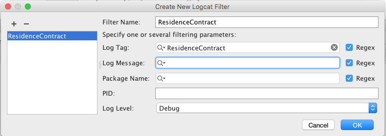

#Layout and Activity

We shall use adapt the MyRent activity from the previous lab. The layout remains the same other than the elimination of the Get RowId.


Here is the MyRent activity code. Previous references to RowId have been deleted. The event handler methods have been retained with empty bodies as placeholders. The exception is the *addResidence* method where the RefreshResidenceService is started and configured to insert the Residence record into the SQLite database:

Filename: *activities/MyRent.java*

```
package sqlite.myrentsqlite.activities;

import android.content.Intent;
import android.os.Bundle;
import android.support.v7.app.AppCompatActivity;
import android.view.View;
import android.widget.Button;
import sqlite.myrentsqlite.R;
import sqlite.myrentsqlite.services.RefreshResidenceService;;


public class MyRent extends AppCompatActivity implements View.OnClickListener
{

  private Button addResidence;
  private Button selectResidence;
  private Button deleteResidence;
  private Button selectAllResidences;
  private Button deleteAllResidences;
  private Button updateResidence;

  @Override
  protected void onCreate(Bundle savedInstanceState) {
    super.onCreate(savedInstanceState);
    setContentView(R.layout.activity_myrent);

    addResidence = (Button) findViewById(R.id.addResidence);
    addResidence.setOnClickListener(this);

    selectResidence = (Button) findViewById(R.id.selectResidence);
    selectResidence.setOnClickListener(this);

    deleteResidence = (Button) findViewById(R.id.deleteResidence);
    deleteResidence.setOnClickListener(this);

    selectAllResidences = (Button) findViewById(R.id.selectAllResidences);
    selectAllResidences.setOnClickListener(this);

    deleteAllResidences = (Button) findViewById(R.id.deleteAllResidences);
    deleteAllResidences.setOnClickListener(this);

    updateResidence = (Button) findViewById(R.id.updateResidence);
    updateResidence.setOnClickListener(this);

  }

  @Override
  public void onClick(View v) {
    switch (v.getId()) {
      case R.id.addResidence:
        addResidence();
        break;

      case R.id.selectResidence:
        selectResidence();
        break;

      case R.id.deleteResidence:
        deleteResidence();
        break;

      case R.id.selectAllResidences:
        selectAllResidences();
        break;

      case R.id.deleteAllResidences:
        deleteAllResidences();
        break;

      case R.id.updateResidence:
        updateResidence();
        break;

    }
  }

  /**
   * Start a RefreshResidence service, passing the intent message ADD_RESIDENCE
   * This determines what functionality is invoked in the service.
   */
  private void addResidence() {
    Intent intent = new Intent(getBaseContext(), RefreshResidenceService.class);
    intent.putExtra(RefreshResidenceService.REFRESH, RefreshResidenceService.ADD_RESIDENCE);
    startService(intent);
  }

  /**
   * Select a single Residence record
   */
  public void selectResidence() {

  }

  /**
   * Select all Residence records
   */
  public void selectAllResidences() {

  }

  public void deleteResidence() {

  }

  /**
   * Delete all records.
   */
  public void deleteAllResidences() {

  }

  /**
   * Update a residence record.
   */
  public void updateResidence() {

  }

}
```
Before testing, ensure that the manifest in MySQLite has set the permission to allow its database access from another app. This is achieved by adding an attribute *android:exported="true"* to the *provider* node as shown here:

```
...
...
    <provider
      android:name="sqlite.myrentsqlite.providers.ResidenceProvider"
      android:authorities="sqlite.myrentsqlite.providers.ResidenceProvider"
      android:exported="true"/>
      
  </application>
```
And most importantly, declare the service in the manifest. Without doing so the service will not start and no warning will be provided.

```
    <service android:name="sqlite.myrentsqlite.services.RefreshResidenceService"/>

```

Build and run the application. Press the Add Residence button. Create an appropriate log filter, for example as shown in Figure 2. Observe the output on the **logcat** window. If should include something like that shown in Figure 1.


Check the database content using the *adb shell* command.


