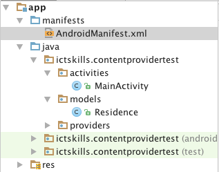
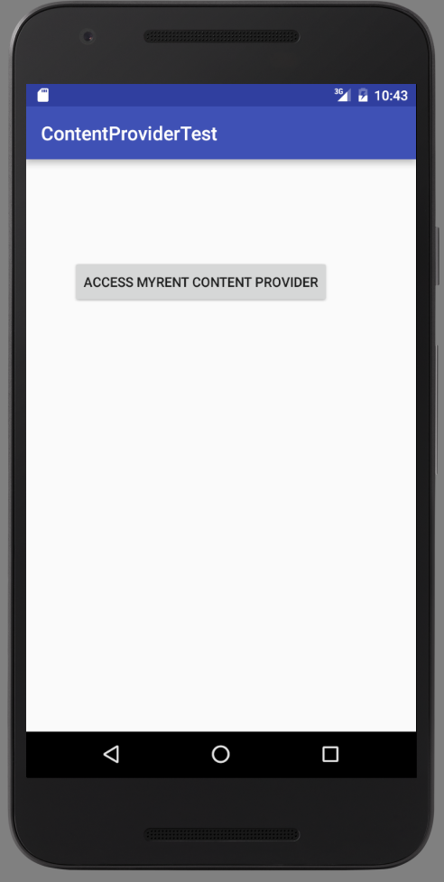
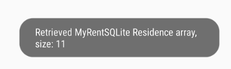

#Test

Here we describe how to access the MyRentSQlite generated database from a different app. Both apps are deployed on the same device.

Create a new Android application named ContentProviderTest, accepting the wizard's defaults but, for compatibility with code samples below, define the company domain as *ictskills*.

Create a project package structure similar to that here:



##Model
Here is the model Residence class. Its fields match the MyRentSQLite model.

```
package ictskills.contentprovidertest.models;
import java.util.Date;

public class Residence
{
  public UUID uuid;
  public Date date;
  public String geolocation;
  public boolean rented;
  public String tenant;
  public double zoom;
  public String photo;

  public Residence() { }
}
```
##Layout

The text file:

```
<?xml version="1.0" encoding="utf-8"?>
<RelativeLayout
    xmlns:android="http://schemas.android.com/apk/res/android"
    xmlns:tools="http://schemas.android.com/tools"
    android:layout_width="match_parent"
    android:layout_height="match_parent"
    android:paddingBottom="@dimen/activity_vertical_margin"
    android:paddingLeft="@dimen/activity_horizontal_margin"
    android:paddingRight="@dimen/activity_horizontal_margin"
    android:paddingTop="@dimen/activity_vertical_margin"
    tools:context="ictskills.contentprovidertest.activities.MainActivity">

  <Button
      android:layout_width="wrap_content"
      android:layout_height="wrap_content"
      android:text="Access MyRent Content Provider"
      android:id="@+id/contentProvider"
      android:layout_alignParentTop="true"
      android:layout_alignParentStart="true"
      android:layout_marginStart="33dp"
      android:layout_marginTop="89dp"/>
</RelativeLayout>

```


##Activity

In the only activity, MainActivity, we add:

- A button handler. A button click invokes a method that reads the SQLite database in the MyRentSQLite app.
- A method, *selectAllResidences*, that populates a locally created Residence list with the content of MyRentSQLite's database. (Ensure that you run MyRentSQLite and add some Residence records before this method is invoked).

```
package ictskills.contentprovidertest.activities;

import android.database.Cursor;
import android.os.Bundle;
import android.support.v7.app.AppCompatActivity;
import android.view.View;
import android.widget.Button;
import java.util.ArrayList;
import java.util.Date;
import java.util.List;
import ictskills.contentprovidertest.R;
import ictskills.contentprovidertest.models.Residence;
import ictskills.contentprovidertest.providers.ResidenceContract;

import android.widget.Toast;

/**
 * Set a button click handler.
 * Handler obtains list Residence records from MyRentSqlite
 * Precondition: MyRentSqlite database must be present.
 * Install and run MyRentSqlite and add some Residence records to populate the database.
 *
 */
public class MainActivity extends AppCompatActivity implements View.OnClickListener
{
  private Button contentProvider;

  @Override
  protected void onCreate(Bundle savedInstanceState) {
    super.onCreate(savedInstanceState);
    setContentView(R.layout.activity_main);

    contentProvider = (Button)findViewById(R.id.contentProvider);
    contentProvider.setOnClickListener(this);
  }

  @Override
  public void onClick(View v) {
    switch(v.getId()) {
      case R.id.contentProvider:
        selectAllResidences();
    }
  }

  /**
   * This code derived from MyRentSQLite.RefreshResidenceService.selectAllResidences.
   */
  private void selectAllResidences() {

    // Query the database
    List<Residence> residences = new ArrayList<Residence>();
    Cursor cursor = getContentResolver().query(ResidenceContract.CONTENT_URI, null, null, null, null);

    if (cursor.moveToFirst()) {
      int columnIndex = 1; // skip column 0, the _id
      do {
        Residence residence = new Residence();

        residence.uuid = UUID.fromString(cursor.getString(columnIndex++));
        residence.geolocation = cursor.getString(columnIndex++);
        residence.date = new Date(Long.parseLong(cursor.getString(columnIndex++)));
        residence.rented = cursor.getString(columnIndex++) == "yes" ? true : false;
        residence.tenant = cursor.getString(columnIndex++);
        residence.zoom = Double.parseDouble(cursor.getString(columnIndex++));
        residence.photo = cursor.getString(columnIndex++);

        columnIndex = 1;

        residences.add(residence);
      } while (cursor.moveToNext());
    }
    cursor.close();
    Toast.makeText(this, "Retrieved MyRentSQLite Residence array, size: " + residences.size(), Toast.LENGTH_SHORT).show();
  }
}

```
Build and deploy the app to a device or emulator on which MyRentSQLite is present and whose database is populated.

Press the ACCESS MYRENT CONTENT PROVIDER button. 

If the app successfully retrieves the database you should see a Toast message somewhat similar to that shown in Figure 3.



The application at the end of this lab is available for reference here: [sqlite_content_provider](https://github.com/wit-ictskills-2016/sqlite-content-provider.git). The content provider is on a branch named contentprovider_complete.

Also available is the application to test the content provider: [sqlite_content_provider_test](https://github.com/wit-ictskills-2016/sqlite-content-provider-test.git).

