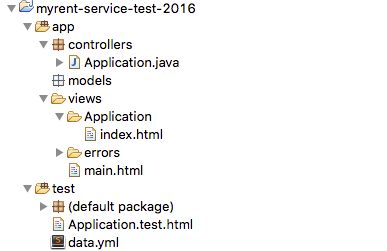
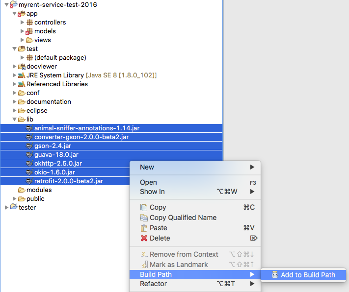

#Simple Test Harness

You should already have Eclipse + Play framework installed on your laptops. For the main part of this lab. Alternatively, you may develop on the NUCs.

You may have seen unit testing in Eclipse for simple Java applications. There is an equivalent for the Play Framework. Unit testing is particularly important if you make any changes to the model, as it allows you to verify if the model is defined correctly.

In a terminal (command line) in a suitable location run the following command and accept the default as the application name (`myrent-service-test-2016`):

```
play new myrent-service-test-2016
```

Change into the project folder and run these commands:

~~~
play deps
play eclipsify
~~~

Import the project into Eclipse. Explore the file structure in the navigation panel on the left. It should be similar to that shown in Figure 1.



Download this [lib.zip](archives/lib.zip) into a temporary folder, expand, and move to the root of myrent-service-test. Then add its contents to the build path as shown in Figure 2. It contains the various library files required, such as those for Retrofit and Gson.



