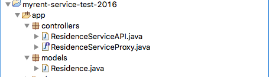

#Controllers

We shall add the service api and proxy classes to the default controller package. The file structure is now as shown in Figure 1:



```
package controllers;

import java.util.List;

import com.google.gson.Gson;
import com.google.gson.GsonBuilder;

import models.Residence;
import retrofit.Call;
import retrofit.GsonConverterFactory;
import retrofit.Response;
import retrofit.Retrofit;

public class ResidenceServiceAPI
{
  private String service_url = "http://localhost:9000";
  private ResidenceServiceProxy service;

  public ResidenceServiceAPI()
  {
    Gson gson = new GsonBuilder().create();

    Retrofit retrofit = new Retrofit.Builder().baseUrl(service_url)
                             .addConverterFactory(GsonConverterFactory
                             .create(gson))
                             .build();
    service = retrofit.create(ResidenceServiceProxy.class);
  }

  public List<Residence> getResidences() throws Exception
  {
    Call<List<Residence>> call = (Call<List<Residence>>) service.getResidences();
    Response<List<Residence>> residences = call.execute();
    return residences.body();
  }
 
  public Residence getResidence(Long id) throws Exception
  {
    Call<Residence> call = service.getResidence(id);
    Response<Residence> residence = call.execute();
    return residence.body();
  }
  
  public Residence createResidence(Residence newResidence) throws Exception
  {
      Call<Residence> call = (Call<Residence>) service.createResidence(newResidence);
      Response<Residence> returnedResidence = call.execute();
      return returnedResidence.body();
  }
  
  public int deleteResidence(Long id) throws Exception
  {
    Call<String> call = service.deleteResidence(id);
    Response<String> val = call.execute();
    return val.code();
  }

  public Residence updateResidence(Residence residence) throws Exception {
    Call<Residence> call = (Call<Residence>)service.updateResidence(residence);
    Response<Residence> returnedResidence = call.execute();
    return returnedResidence.body();
  }
}
```

```
package controllers;

import java.util.List;

import models.Residence;
import retrofit.Call;
import retrofit.http.Body;
import retrofit.http.DELETE;
import retrofit.http.GET;
import retrofit.http.POST;
import retrofit.http.Path;

public interface ResidenceServiceProxy
{

  
  // Residence
  @POST("/api/residence")
  Call<Residence> createResidence(@Body Residence residence);
  
  @DELETE("/api/residences/{id}")
  Call<String> deleteResidence(@Path("id") Long id);
  
  @POST("/api/residence/update")
  Call<Residence> updateResidence(@Body Residence residence);
  
  @GET("/api/residences")
  Call<List<Residence>> getResidences();
  
  @GET("/api/residences/{id}")
  Call<Residence> getResidence(@Path("id") Long id);
}

```


