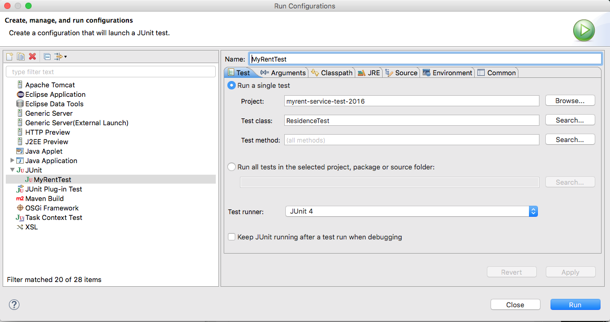
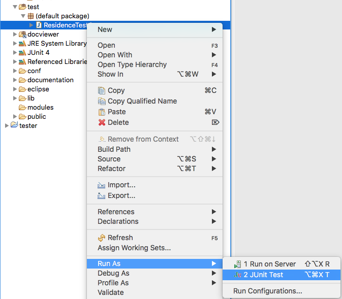
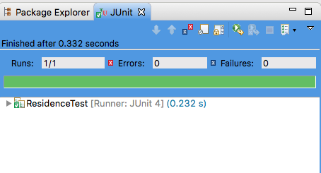

#Test class

Create a class ResidenceTest in the default test package and populate with setup data as shown here. Observe that we are writing 8 residence instances to the service database.

```


import org.junit.Before;

import controllers.ResidenceServiceAPI;
import models.Residence;

public class ResidenceTest {
  private static ResidenceServiceAPI service = new ResidenceServiceAPI();

  private int NUMBER_residences = 8;

  static Residence residences[] = 
    { 
        new Residence(), 
        new Residence(), 
        new Residence(), 
        new Residence(),
        new Residence(), 
        new Residence(), 
        new Residence(), 
        new Residence(),
    };
  
}

  /**
   * Create an array of residences.
   * @throws Exception
   */
  @Before
  public void setup() throws Exception {
    service.createResidence(residences[0]);
    service.createResidence(residences[1]);
    service.createResidence(residences[2]);
    service.createResidence(residences[3]);
    service.createResidence(residences[4]);
    service.createResidence(residences[5]);
    service.createResidence(residences[6]);
    service.createResidence(residences[7]);
  }

```

Now add a teardown method to clean up at the end of the test run:

```
  /**
   * Clean up following tests.
   * @throws Exception
   */
  @After
  public void teardown() throws Exception {
    for (int i = 0; i < residences.length; i += 1) {
      service.deleteResidence(residences[i].id);
    }
  }
```

Let's now add a single test. This will fetch the entire list of residences across the network and check that the number corresponds to the setup number.

```
  /**
   * Obtain entire collection of residences
   * @throws Exception
   */
  @Test
  public void getResidences() throws Exception {
    List<Residence> list = service.getResidences();
    assertEquals(list.size(), NUMBER_RESIDENCES);
  }
```

These import statments are required.

```
import static org.junit.Assert.assertEquals;
import java.util.List;
import org.junit.After;
import org.junit.Before;
import org.junit.Test;
import controllers.ResidenceServiceAPI;
import models.Residence;
```

Before running this test it is necessary to create a run configuration as shown here in Figure 1. But first ensure that the JUnit 4 jar is present and has been added to the build path.



Figure 2 shows how to run the test.



A successful test should result in a window display similar to that shown in Figure 3.

