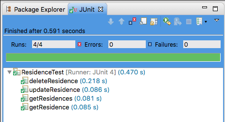

#More tests

To conclude this short set of tests, add the following:

- `getResidence`: gets a single residence.
- `deleteResidence`: deletes a single residence.
- `updateResidence`: updates a single residence.

Here is the code to add to ResidenceTest:

```
/**
 * Check the getResidence api
 * @throws Exception
 */
 @Test
 public void getResidence() throws Exception {
   Residence residence = service.getResidence(residences[0].id);
   assertEquals(residence.id, residences[0].id);
 }
 
 /**
  * Delete a single residence
  * @throws Exception
  */
 @Test
 public void deleteResidence() throws Exception {
   Long residenceId = residences[0].id;
   int rval = service.deleteResidence(residenceId);
   assertEquals(rval, 200);
 }
 
 @Test
 public void updateResidence() throws Exception {
   Residence res = residences[3];
   // Make some changes
   res.photo = "Homer's portrait";
   res.rented = true;
   res.tenant = "Homer Simpson";
   Residence returnedRes = service.updateResidence(res);
   assertEquals(returnedRes, res);
 }
```
Run the test suite. A successful run should result in a JUnit pane output as shown in Figure 1:



The End (Also TG).