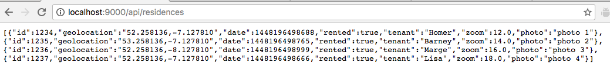

#Exploring that API

The program should now build without error. Launch it and browse to the database and study the contents:

```

localhost:9000/@db
```

If you are having difficulty launching the h2 browser with the above command, use Postman.

Also, in a browser explore the urls:

```
http://localhost:9000/api/residences
```



```
http://localhost:9000/api/residences
```


##Postman

Launch Postman from within Chrome:


Explore the GET and DELETE HTTP commands. Here in Figure 4 is an example of the use of GET.

