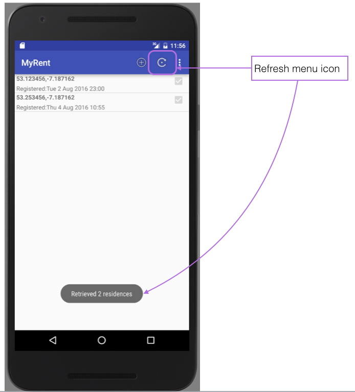

#Setup

Two completed Play apps and an Android app accompany this lab. They are available for downloading as follows:

<h4>Play apps</h4>

Download [MyRent service](archive/myrent-service-2016.zip) : a server app configured to run on localhost. 

Download [JUnit tester](archive/myrent-service-2016.zip) : a JUnit app used to test the server app.

These two Play apps correspond to the Andoid app you will have developed at the end of this lab.

To run the service (at the conclusion of the lab):

- Expand the archive.
- Change into the expanded folder `myrent-service-2016`.
- Run the command `play run`

<h4>Android app:</h4>

Download [MyRent Android client](archive/myrent.zip).

Figure 2 represents MyRent listview with this lab's features implemented. The only visual difference to the previous version is the presence of the refresh menu item that allows a user to manually refresh the local storage with the content of the remote database. However, significant changes to the code base will become evident as you proceed through the lab.

