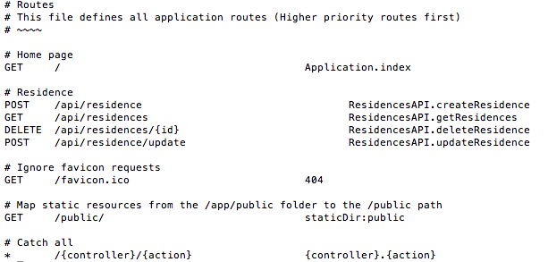

#Retrofit setup

Here is the official documentation on the Retrofit client:

[Retrofit - Square Open Source](http://square.github.io/retrofit/).

We shall now integrate this feature.

Add these dependencies to build.gradle (Module: app) and sync the project as prompted at the top of the gradle file:

```
    compile 'com.squareup.retrofit:retrofit:2.0.0-beta2'
    compile 'com.squareup.retrofit:converter-gson:2.0.0-beta2'
    compile 'com.squareup.okhttp:okhttp:2.4.0'
    compile 'com.google.code.gson:gson:2.4'

```

In Android Studio's project window add a package `retrofit`. 


In this new package create a class ResidenceServiceProxy.java containing the following content:

```

package org.wit.myrent.retrofit;

import org.wit.myrent.models.Residence;

import java.util.List;

import retrofit.Call;
import retrofit.http.Body;
import retrofit.http.DELETE;
import retrofit.http.GET;
import retrofit.http.POST;
import retrofit.http.Path;

public interface ResidenceServiceProxy
{
  @POST("/api/residence")
  Call<Residence> createResidence(@Body Residence residence);

  @DELETE("/api/residences/{id}")
  Call<String> deleteResidence(@Path("id") Long id);

  @POST("/api/residence/update")
  Call<Residence> updateResidence(@Body Residence residence);

  @GET("/api/residences")
  Call<List<Residence>> getResidences();

}

```

Sync the project. It should remain error free.

Study the content of this interface and compare it to the routes file in the Play server app downloaded earlier in the project and shown here in Figure 2.




