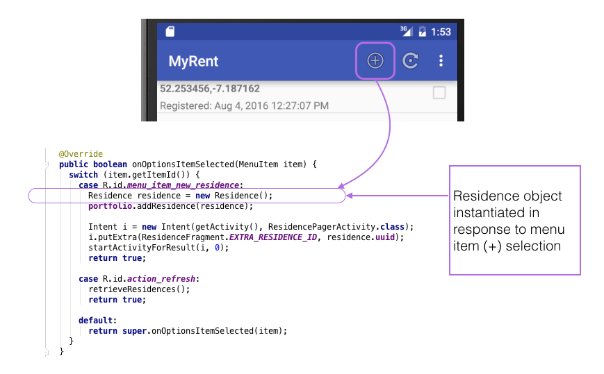

#Create

Here we shall create a Residence object and transmit it across the network to be saved in the database on the server.

Presently, in the method `onOptionsItemSelected`, a new Residence object is created as a reponse to the menu item (+) selection and this object is saved to the local database. See Figure 1.



Additionally, we shall now save the Residence object across the network. But first change the ResidenceListFragment header so as to implement the Retrofit interface Callback, using Residence as a parameter, and implement the interface's methods `onResponse` and `onFailure`:

```

public class ResidenceListFragment extends ListFragment implements
    OnItemClickListener,
    AbsListView.MultiChoiceModeListener,
    Callback<Residence>
```

```

  @Override
  public void onResponse(Response<Residence> response, Retrofit retrofit) {

  }

  @Override
  public void onFailure(Throwable t) {

  }

```

These import statements are required:

```
import retrofit.Call;
import retrofit.Callback;
import retrofit.Response;
import retrofit.Retrofit;

```
We shall shortly complete the implementation of the above two methods.

Add this statement immediately following `portfolio.addResidence(residence)` in `onOptionsItemSelected`:

```
createResidence(residence);
```

Implement `createResidence`. It sends an an asynchronous request to the server and elicits a response which is handled by one of of the two methods, `onResponse`, `onFailure`.


```
  public void createResidence(Residence res) {
    Call<Residence> call = app.residenceService.createResidence(res);
    call.enqueue(this);
  }
```

Here are the the fully implemented Callback methods:

```
  @Override
  public void onResponse(Response<Residence> response, Retrofit retrofit) {
    Residence returnedResidence = response.body();
    if (returnedResidence != null) {
      Toast.makeText(getActivity(), "Residence created successfully", Toast.LENGTH_SHORT).show();
    }
    else {
      Toast.makeText(getActivity(), "Residence null object returned due to incorrectly configured client", Toast.LENGTH_SHORT).show();

    }

  }

  @Override
  public void onFailure(Throwable t) {
    Toast.makeText(getActivity(), "Failed to create residence due to unknown network issue", Toast.LENGTH_SHORT).show();

  }
```

Test as follows:

1. Start the service: myrent-service-2016.
2. Build and deploy MyRent apk to the emulator or physical device.
3. Create a new Residence.
4. Use the Toast message generated within one of the Callback methods to determine if the new Residence object has been successfully saved to the server database.


