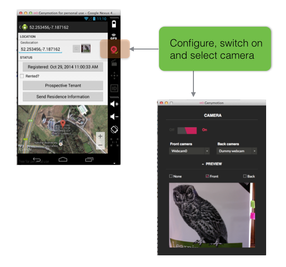
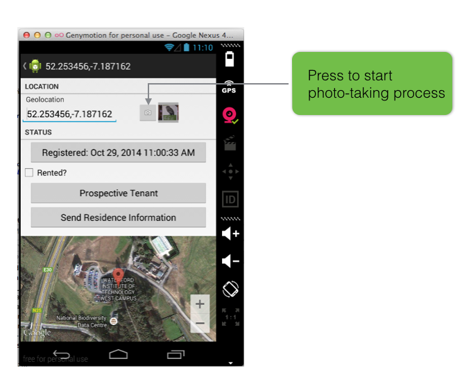
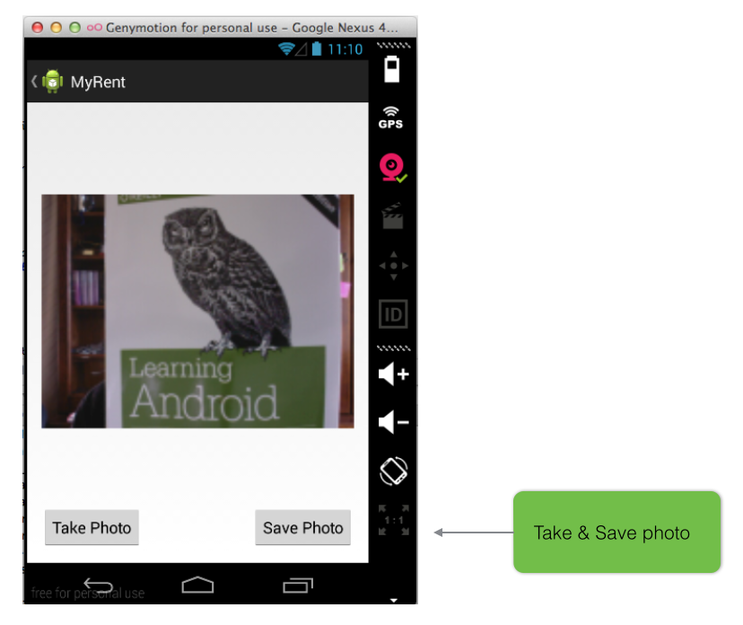

#Preview

In this lab you will use the device camera to take a photo.

- The photo may be saved to a file
- It will appear as a thumbnail in the residence details view
- An enlarged image will be viewable in a one-photo gallery

The following figures provide an outline.

