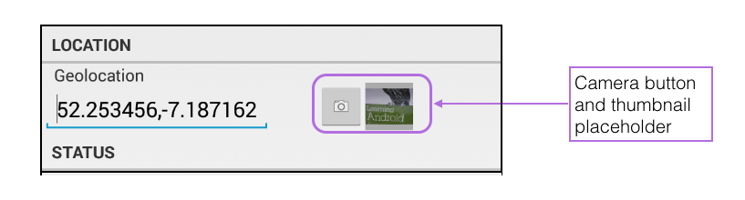
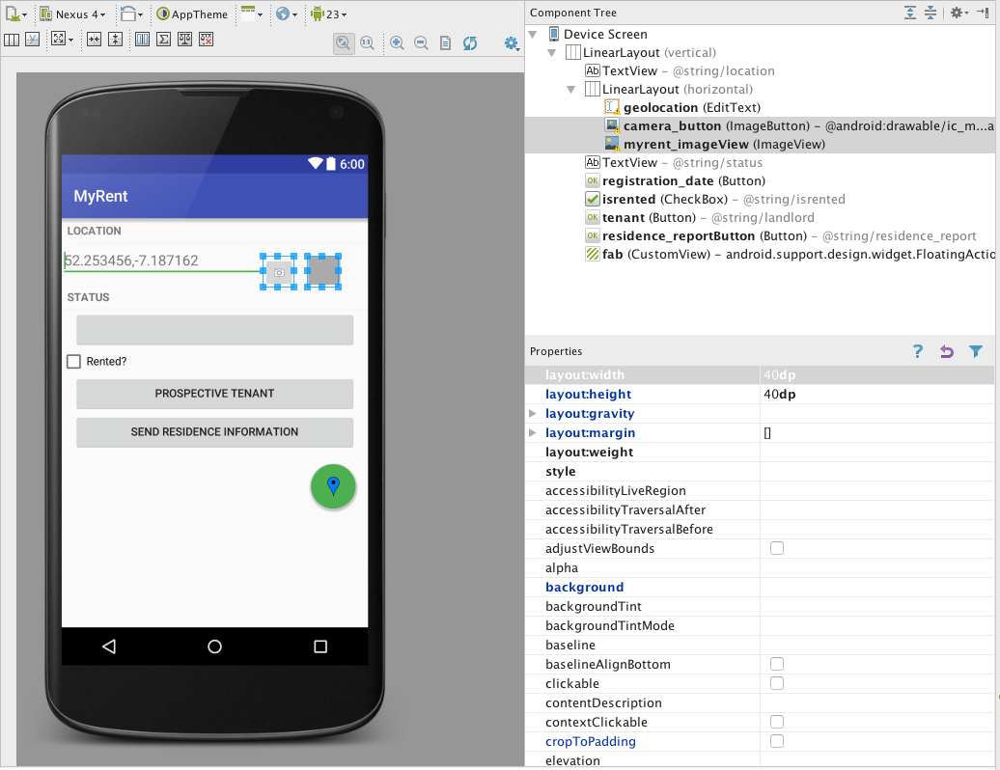
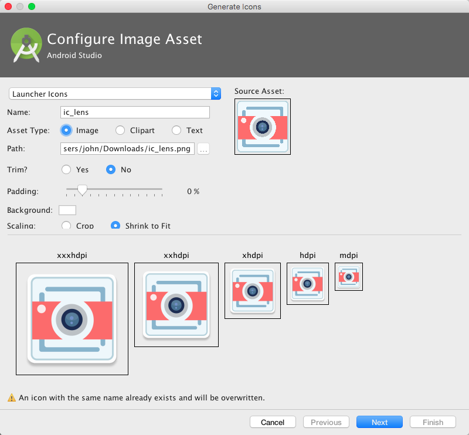
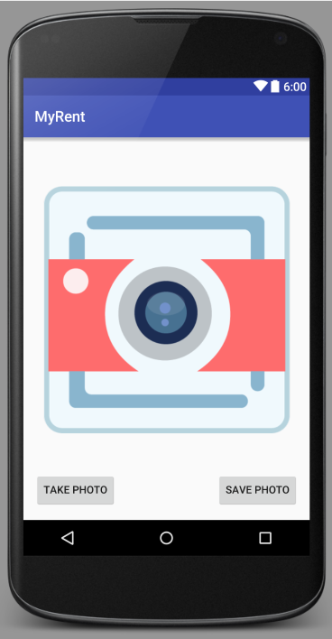
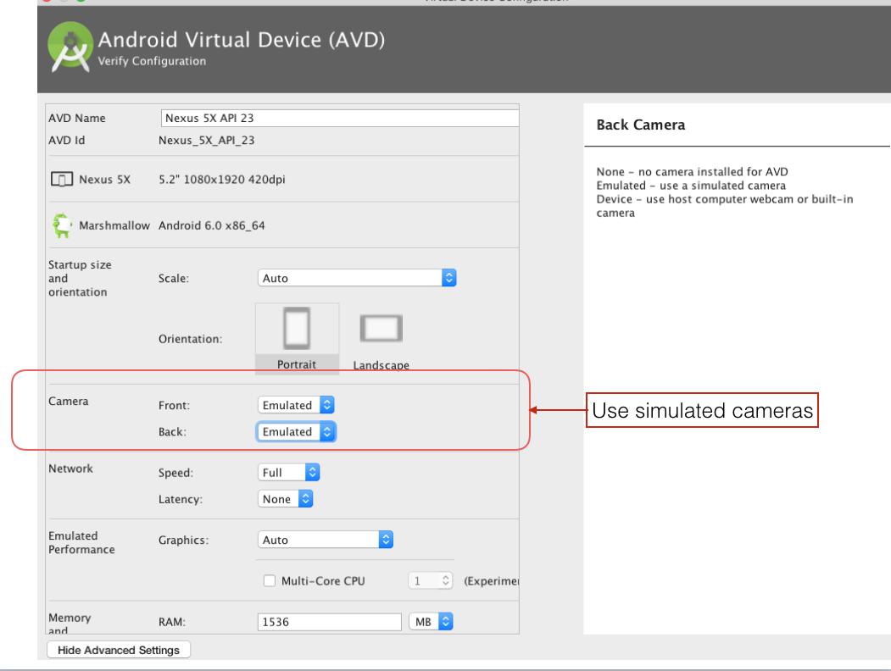

#Resources


##Manifest

Proceeding with the application as [completed to the end of the previous lab](https://github.com/wit-ictskills-2016/myrent-14.git), we shall add two new activities, the content for which is provided in a later step:

- ResidenceCameraActivity
    - Manages the taking of a photo
- ResidenceGalleryActivity
    - Allows the display of the photo in a single-photo gallery.


Modify manifest file: add following snippets.

```
    <activity
        android:name=".activities.ResidenceCameraActivity"
        android:label="@string/app_name">
        
        <meta-data android:name="android.support.PARENT_ACTIVITY"
                   android:value=".activities.ResidencePagerActivity"/>
    </activity>
    <activity
        android:name=".activities.ResidenceGalleryActivity"
        android:label="@string/app_name">
        
        <meta-data android:name="android.support.PARENT_ACTIVITY"
                   android:value=".activities.ResidencePagerActivity"/>
    </activity>

```

##Residence details view layout

We add a Camera button and a thumnail placeholder to the Residence details view: 

- layout/fragment_residence.xml






First add 2 string resources:

```
  <string name="take_photo">Take Photo</string>
  <string name="save_photo">Save Photo</string>
```
Here is the additional code:

```
<!-- Camera button + thumbnail-->
      <ImageButton
          android:id="@+id/camera_button"
          android:layout_width="40dp"
          android:layout_height="40dp"
          android:scaleType="centerInside"
          android:layout_marginTop="16dp"
          android:src="@android:drawable/ic_menu_camera"
          android:layout_gravity="top"/>
      <ImageView
          android:id="@+id/myrent_imageView"
          android:layout_width="40dp"
          android:layout_height="40dp"
          android:scaleType="centerInside"
          android:background="@android:color/darker_gray"
          android:cropToPadding="true"
          android:layout_marginTop="16dp"
          android:layout_gravity="top|end"
          android:layout_margin="16dp"/>

```
As you can see, the code is located immediately following the geolocation input window. 

For reference, here is the refactored fragment_residence.xml file:

```
<LinearLayout xmlns:android="http://schemas.android.com/apk/res/android"
              android:layout_width="match_parent"
              android:layout_height="match_parent"
              android:orientation="vertical" >

  <!-- LOCATION -->

  <TextView
      style="?android:listSeparatorTextViewStyle"
      android:layout_width="match_parent"
      android:layout_height="wrap_content"
      android:text="@string/location" />

  <LinearLayout
      android:layout_width="match_parent"
      android:layout_height="51dp"
      android:baselineAligned="false"
      android:orientation="horizontal"
      android:weightSum="1">

    <!-- Geolocation (GPS Coords) -->

    <EditText
        android:id="@+id/geolocation"
        android:layout_width="194dp"
        android:layout_height="wrap_content"
        android:hint="@string/geolocation_hint"
        android:layout_weight="0.75">

      <requestFocus />
    </EditText>

    <!-- Camera button + thumbnail-->
      <ImageButton
          android:id="@+id/camera_button"
          android:layout_width="40dp"
          android:layout_height="40dp"
          android:scaleType="centerInside"
          android:layout_marginTop="16dp"
          android:src="@android:drawable/ic_menu_camera"
          android:layout_gravity="top"/>
      <ImageView
          android:id="@+id/myrent_imageView"
          android:layout_width="40dp"
          android:layout_height="40dp"
          android:scaleType="centerInside"
          android:background="@android:color/darker_gray"
          android:cropToPadding="true"
          android:layout_marginTop="16dp"
          android:layout_gravity="top|end"
          android:layout_margin="16dp"/>

  </LinearLayout>

  <!-- STATUS -->

  <TextView
      style="?android:listSeparatorTextViewStyle"
      android:layout_width="match_parent"
      android:layout_height="wrap_content"
      android:text="@string/status" />

  <Button android:id="@+id/registration_date"
          android:layout_width="match_parent"
          android:layout_height="wrap_content"
          android:layout_marginLeft="16dp"
          android:layout_marginRight="16dp"
      />
  <!-- Checkbox -->
  <CheckBox
      android:layout_width="wrap_content"
      android:layout_height="wrap_content"
      android:text="@string/isrented"
      android:id="@+id/isrented"
      android:checked="false"/>

  <Button
      android:id="@+id/tenant"
      android:layout_width="match_parent"
      android:layout_height="wrap_content"
      android:layout_marginLeft="16dp"
      android:layout_marginRight="16dp"
      android:text="@string/landlord" />

  <Button android:id="@+id/residence_reportButton"
          android:layout_width="match_parent"
          android:layout_height="wrap_content"
          android:layout_marginLeft="16dp"
          android:layout_marginRight="16dp"
          android:text="@string/residence_report"
      />


  <android.support.design.widget.FloatingActionButton
      android:id="@+id/fab"
      android:layout_width="wrap_content"
      android:layout_height="wrap_content"
      android:layout_gravity="bottom|end"
      android:layout_margin="@dimen/fab_margin"
      android:src="@drawable/ic_blue_marker"/>
</LinearLayout>

```
##Camera layout

Next we add a layout for the Camera activity:

File: /res/layout/residence_photo.xml
```
<RelativeLayout xmlns:android="http://schemas.android.com/apk/res/android"
                xmlns:tools="http://schemas.android.com/tools"
                android:layout_width="match_parent"
                android:layout_height="match_parent"
                android:paddingBottom="@dimen/activity_vertical_margin"
                android:paddingLeft="@dimen/activity_horizontal_margin"
                android:paddingRight="@dimen/activity_horizontal_margin"
                android:paddingTop="@dimen/activity_vertical_margin"
                tools:context="org.wit.myrent.activities.ResidenceCameraActivity" >

  <ImageView
      android:id="@+id/residenceImage"
      android:layout_width="match_parent"
      android:layout_height="wrap_content"
      android:layout_above="@+id/takePhoto"
      android:layout_alignParentRight="true"
      android:layout_alignParentTop="true"
      android:src="@mipmap/ic_lens"/>

  <Button
      android:id="@+id/takePhoto"
      android:layout_width="wrap_content"
      android:layout_height="wrap_content"
      android:layout_alignLeft="@+id/residenceImage"
      android:layout_alignParentBottom="true"
      android:text="@string/take_photo" />

  <Button
      android:id="@+id/savePhoto"
      android:layout_width="wrap_content"
      android:layout_height="wrap_content"
      android:layout_alignBottom="@+id/takePhoto"
      android:layout_alignRight="@+id/residenceImage"
      android:layout_alignTop="@+id/takePhoto"
      android:text="@string/save_photo" />

</RelativeLayout>

```
Download the image ic_lens.png from [here](archives/ic_lens.png) to a temp location.

- In Android Studio select *res/mipmap*, right click and select `new|Image Asset`.
- The `Configure Image Asset` window should open.
- Change the name to `ic_lens`.
- Browse to where you have saved the ic_lens image and select it.
- The result should be as represented in Figure 3.
- Overwrite ic_lens if it already exist.
- Complete the remaining steps in the configuration wizard.






##Emulator
If using an Android emulator ensure you enable at least one camera simulator in the settings. This is illustrated in Figure 5.

