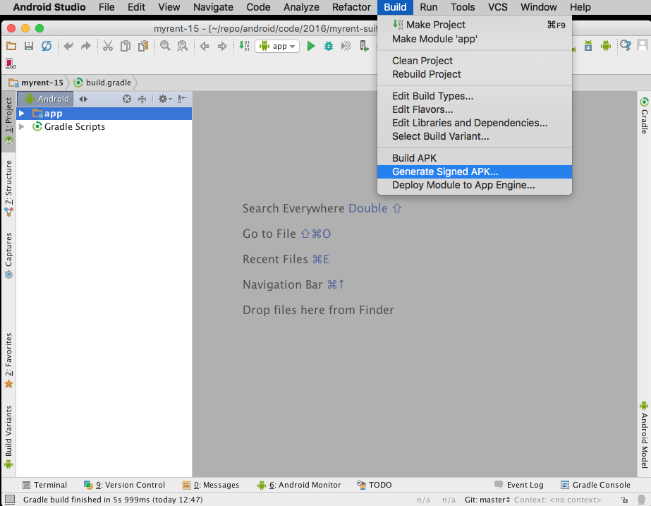
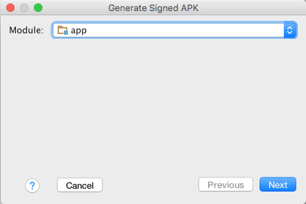
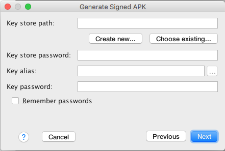
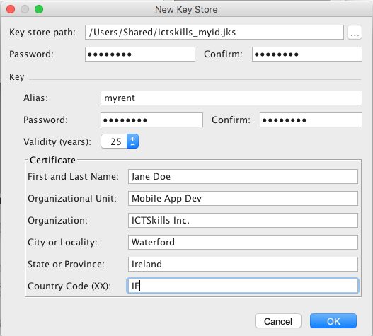
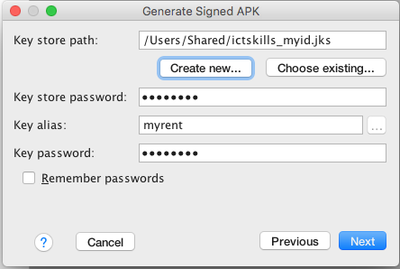
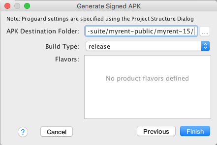
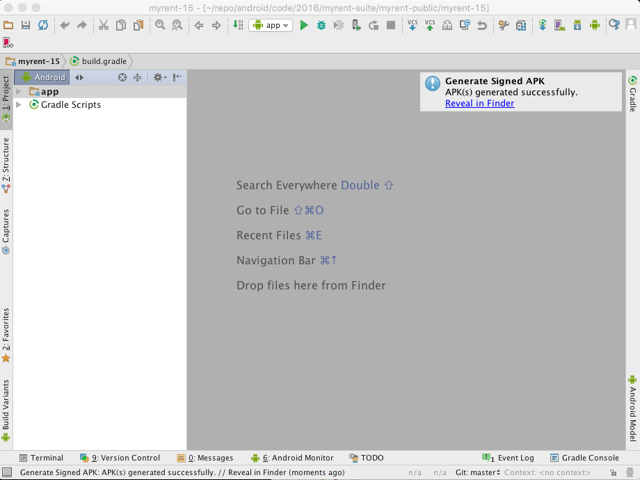
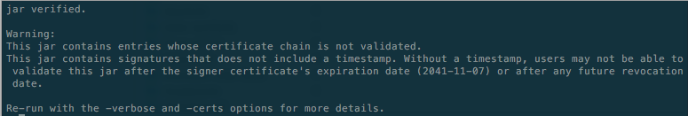

#Sign MyRent  

##APK signing

Here we shall build and sign a release version of MyRent.

Use your final version of the app or alternatively download and use a copy from wit-computing GitHub repo: [MyRent-15](https://github.com/wit-ictskills-2016/myrent-15.git).

- Import the project into Android Studio.

- In the menu bar, click Build > Generate Signed APK.



- Select the app module from the drop down and click Next.



- On the New Key Store window, provide the following information for your keystore and key (Figures 3 & 4).

##Keystore

- Key store path: Select the location where your keystore should be created.
- Password: Create and confirm a secure password for your keystore.

##Key 

- Alias: Enter an identifying name for your key.
- Password: Create and confirm a secure password for your key. This should be different from the password you chose for your keystore
- Validity (years): Set the length of time in years that your key will be valid. Your key should be valid for at least 25 years, so you can sign app updates with the same key through the lifespan of your app.
- Certificate: Enter some information about yourself for your certificate. This information is not displayed in your app, but is included in your certificate as part of the APK.
Once you complete the form, click OK.





- On the Generate Signed APK Wizard window, select a keystore, a private key, and enter the passwords for both. (If you created your keystore in the last step, these fields are already populated for you as shown in Figure 5.) Then click Next.



- On the next window, select a destination for the signed APK(s) & click Finish. See Figures 6 & 7.





Further details are available in the official documentation, for example how to automatically sign the apk, how to include flavours and so on: [Sign Your App](https://developer.android.com/studio/publish/app-signing.html).

Browse to where the apk is stored on your computer and test by dragging and dropping onto an emulator or installing onto a physical device (tethered to your computer).

You will find instructions on how to publish your app on the Google Play Store in the [Google Play Developer Console Help Center](https://support.google.com/googleplay/android-developer/answer/113469?hl=en)

##APK verification

In a terminal (OSX) or command prompt (Windows) change into the directory where the recently signed apk resides. Then run this command:

```
jarsigner -verify -certs app-release.apk 
```
A typical output is shown in Figure 8.

If you require more detail run the command with the -verbose switch.



To run jarsigner on Windows it is necessary that you:

- have installed Java JDK. This is available to download from the [Java SE Development Kit 8 Downloads](http://bit.ly/1lO1FSV) page.
- added JDK to path.  Instructions are available here: [Updating the PATH Environment Variable (Optional)](http://bit.ly/2ft1y20)