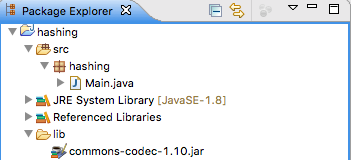
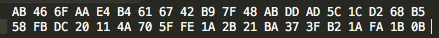
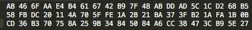

#Hashing

We shall demonstrate the generation of a SHA-1 hash.

Create a Java project in Eclipse IDE named `hashing`. 

In `hashing` source file create a class named `Main`:

```

package hashing;

public class Main {
  
  public static void main(String[] args) {
    
  }

}


```


Download Apache Commons Codec 1.10 file [commons-codec-1.10-bin.zip](http://bit.ly/2f6pHet):

- Unzip `commons-codec-1.10-bin.zip`.
 
- Locate `commons-codec-1.10.jar` and move to a `lib` folder in the root of the project as shown in Figure 1.

- Select the jar in the navigation panel, right click to open the context menu and add the jar to the build path.



Add a method to convert an array of bytes to a hex string:

```

  public static void byteToHex(byte[] bytes) {
    StringBuilder sb = new StringBuilder();
    for (byte b : bytes) {
        sb.append(String.format("%02X ", b));
    }
    System.out.println(sb.toString());
  }

```

Import `DigestUtils` from the Apache Commons Codec jar:

```

import org.apache.commons.codec.digest.DigestUtils;


```

Study the [DigestUtils JavaDoc](http://bit.ly/1KBZzTS). We shall use its `sha1` method to obtain the SHA-1 hash of a string in the form of a byte array which we shall then convert and print as the familiar hex string.

Refactor Main:

```
  public static void main(String[] args) {
    
    byteToHex(DigestUtils.sha1("ICTSkills_2015"));
    byteToHex(DigestUtils.sha1("ICTSkills_2016"));
  }

```

Run the program and study the output. It should match that in Figure 2. Observe how very different the two hash values are despite the inputs differing only 1 the last character.



Now obtain the hash value of a longer string and note that its length is the same as that of each of the earlier strings:

```

    String lorem = "Lorem ipsum dolor sit amet, consectetur adipiscing elit, "
            + "sed do eiusmod tempor incididunt ut labore et dolore magna aliqua. "
            + "Ut enim ad minim veniam, quis nostrud exercitation ullamco laboris "
            + "nisi ut aliquip ex ea commodo consequat. Duis aute irure dolor in "
            + "reprehenderit in voluptate velit esse cillum dolore eu fugiat nulla "
            + "pariatur. Excepteur sint occaecat cupidatat non proident, sunt in "
            + "culpa qui officia deserunt mollit anim id est laborum.";


```



For reference, here is the complete Main class in which we have moved the contents of `main` to a method `public void sha1()`:


```

package hashing;
import org.apache.commons.codec.digest.DigestUtils;

public class Main {

  public static void byteToHex(byte[] bytes) {
    StringBuilder sb = new StringBuilder();
    for (byte b : bytes) {
        sb.append(String.format("%02X ", b));
    }
    System.out.println(sb.toString());
  }
 
   public static void sha1() {
    byteToHex(DigestUtils.sha1("ICTSkills_2015"));
    byteToHex(DigestUtils.sha1("ICTSkills_2016"));
    String lorem = "Lorem ipsum dolor sit amet, consectetur adipiscing elit, "
            + "sed do eiusmod tempor incididunt ut labore et dolore magna aliqua. "
            + "Ut enim ad minim veniam, quis nostrud exercitation ullamco laboris "
            + "nisi ut aliquip ex ea commodo consequat. Duis aute irure dolor in "
            + "reprehenderit in voluptate velit esse cillum dolore eu fugiat nulla "
            + "pariatur. Excepteur sint occaecat cupidatat non proident, sunt in "
            + "culpa qui officia deserunt mollit anim id est laborum.";
    byteToHex(DigestUtils.sha1(lorem));    
  }

  public static void main(String[] args) {
    
    sha1();
  }

}


```