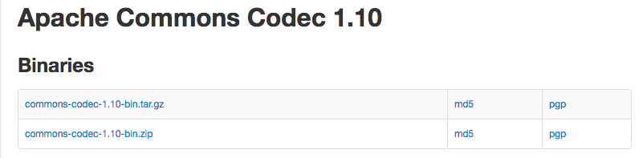
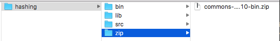
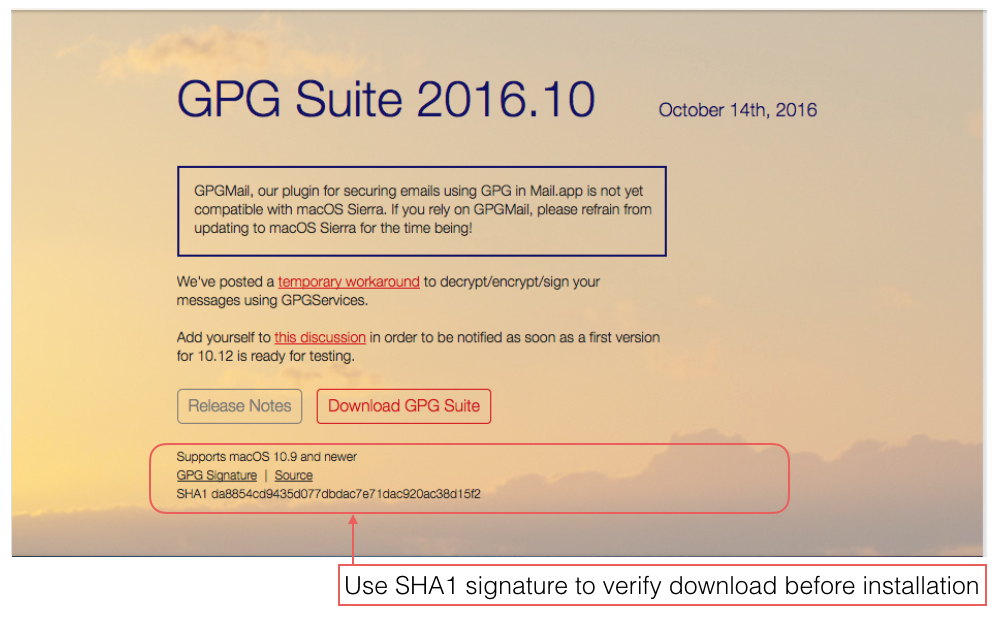
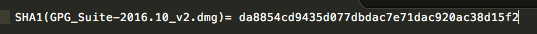
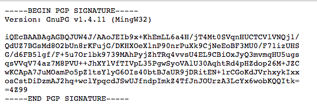
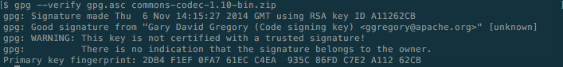

#Integrity check

In the previous step we downloaded the Apache file `commons-codec-1.10-bin.zip` available at [Download Apache Commons Codec](http://commons.apache.org/proper/commons-codec/download_codec.cgi) and made use of a contained `jar` file. However we did not check the integrity of the file. Somehow, during the downloading operation, it could have been possible that the zip file was tampered with. For example `commons-codec-1.10.jar` might have been replaced with a malicious version containing a keylogger. This would be referred to as a `man in the middle` attack. (MiTM). To guard against this, the Apache Commons site has provided us with the downloadable zip file's `pgp` signature and `md5` hash. This is shown in Figure 1.



We shall verify using both md5 and pgp.

##md5 verification

The [md5 algorithm](https://en.wikipedia.org/wiki/MD5) produces a 128-bit (16-byte) hash value.

Click on [md5](http://bit.ly/2g929db) to reveal the hash value for `commons-codec-1.10-bin.zip`:

```
59b6046b8cb5bf48c3b2e63bb4424779
```
We shall now implement a method in our hasing project to calculate the md5 hash value of the downloaded file.

First, download the file [guava.jar](http://www.java2s.com/Code/JarDownload/guava/guava.jar.zip) into the `lib` folder and add it to the build path.

Next, place the downloaded file `commons-codec-1.10-bin.zip` in a new folder named `zip` located in the root of the `hashing` project. See Figure 2.



Add a method to calculate the hash value:

```
  public static void md5() {
    File file = new File("./zip/commons-codec-1.10-bin.zip");
    try {
      byte[] data = Files.toByteArray(file);
      byteToHex(DigestUtils.md5(data));
    } catch (IOException e) {
      e.printStackTrace();
    }
  }
```

These import statements are required:

```
import java.io.File;
import java.io.IOException;
import com.google.common.io.Files;

```
Invoke `md5()`. The output should be similar to that shown in Figure 3. This should match the published hash value (also shown above).


Several online md5 algorithms are also available some of which you might consider experimenting with.

##pgp verification

A requirement is that the [GPG Suite](https://gpgtools.org/) or similar application is installed on your computer. In the case of Windows you can use [Gpg4win](http://www.gpg4win.org/).

Download the suite but before installing verify using the SHA1 signature supplied on the GPG site. You may find the [Quick Start Tutorial](http://bit.ly/1DbcGKi) helpful.

On OSX verification may be performed by changing into the directory where the GPG suite has been saved and running a command similar to the following.

```
openssl sha1 GPG_Suite-2016.10_v2.dmg 
```


This should generate an output similar to that shown in Figure 5. Check this against the published signature.



Now download the pgg signature. This will appear as shown in Figure 6. Copy it into a text editor and save it with a `.asc` extension, for example `gpg.asc`. Save the file to the same location as the download file that we wish to verify. 




Then run the following verifying command. The output should be something similar to that shown in Figure 7.

```
gpg --verify gpg.asc commons-codec-1.10-bin.zip 
```



Further useful information is available at [Apache OpenOffice](https://www.openoffice.org/download/checksums.html).