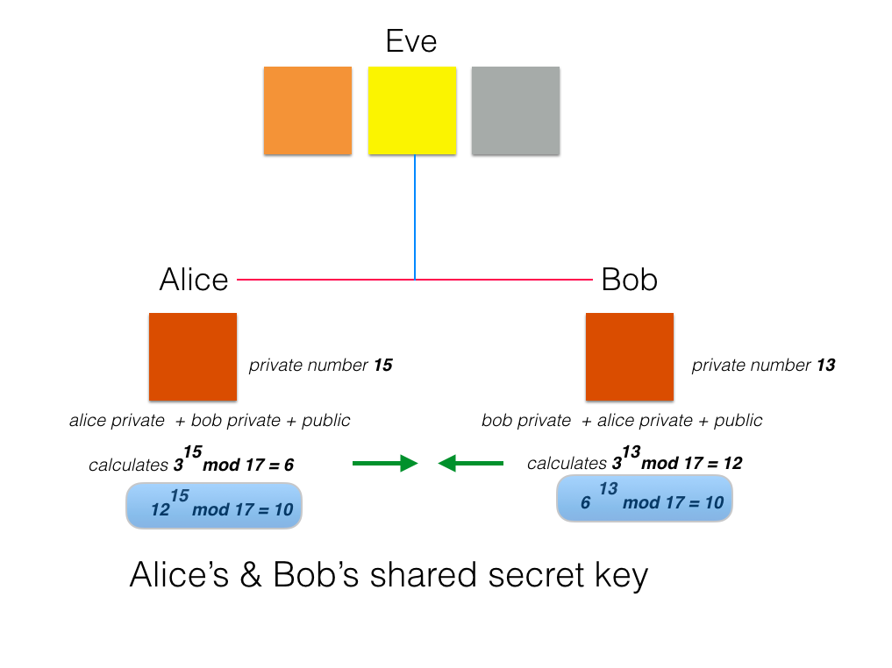
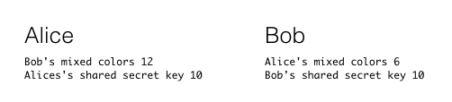

#Key exchange

Discovered independently by Malcolm Williamson (1973) at GCHQ, England and later by Whitfield Diffie and Martin Hellman (1976). Generally referred to as Diffie-Hellman.

Here is a slide from the presentation decks that describes what we shall now implement in a simple Java program:



In the program we use a type [BigInteger](https://goo.gl/Z4Xprq) because it is suited to modular arithmetic and to cryptography given the very large prime numbers used. Remember that using Math.pow() function to raise a number to an exponent requires parameter types to be doubles. This does not suit modular arithmetic where all types are natural numbers (0, 1, 2, . . .).

Create a project named `key_exchange` and in a package, also named key_exchange, create two classes, one `Alice`, the other `Bob`. The presence of the eavesdropper `Eve` is implicit and represented by the use of public fields and methods.

Add fields to both classes.

```

package key_exchange;

import java.math.BigInteger;

public class Alice {

  public static BigInteger Z = BigInteger.valueOf(17); // Modulus
  public static BigInteger g = BigInteger.valueOf(3); // Generator
  private static BigInteger d = BigInteger.valueOf(15); // Alice's private number

}
```

```
package key_exchange;

import java.math.BigInteger;

public class Bob {

  public static BigInteger Z = BigInteger.valueOf(17); // Modulus
  public static BigInteger g = BigInteger.valueOf(3); // Generator
  private static BigInteger d = BigInteger.valueOf(13); // Bob's private number

}

```

We shall now program the equivalent of mixing colours. 

- Alice and Bob adds their private colours to the public colour.
- This is represented mathematically by raising the generator to the power of each person's private number.

In the class Alice:
```
  public static BigInteger mixedColors() {
    return g.modPow(d, Z); // g raised to power d modulo Z
  }
```

In the class Bob the code is exactly the same:
```
  public static BigInteger mixedColors() {
    return g.modPow(d, Z); // g raised to power d modulo Z
  }
```
The methods are public as the data is transmitted in the clear and so accessible to Eve.

With this information both Alice and Bob are in a position to generate the shared secret key. Here are the methods to do so. Notice the difference between them.

Alice:

```
  /**
   * Bob's mixed colors + Alice's secret color
   * @return Shared secret key
   */
  private static BigInteger sharedSecretKey() {
    return Bob.mixedColors().modPow(d, Z);
  }
```

Bob:
```
  /**
   * Alice's mixed colors + Bob's secret color
   * @return Shared secret key
   */
  private static BigInteger sharedSecretKey() {
    return Alice.mixedColors().modPow(d, Z);
  }
```

We conclude by adding `main` methods and printing the secret keys (and additionally the mixed colours).

Alice:

```
  public static void main(String[] args) {
    System.out.println("Bob's mixed colors " + Bob.mixedColors());
    System.out.println("Alices's shared secret key " + sharedSecretKey());
  }
```

Bob:
```
  public static void main(String[] args) {
    System.out.println("Alice's mixed colors " + Alice.mixedColors());
    System.out.println("Bob's shared secret key " + sharedSecretKey());

  }
```
Run each main function in turn. The expected out is shown in Figure 2.



For reference here are the classes: Alice and Bob.

```
package key_exchange;

import java.math.BigInteger;

public class Alice {

  public static BigInteger Z = BigInteger.valueOf(17); // Modulus
  public static BigInteger g = BigInteger.valueOf(3); // Generator
  private static BigInteger d = BigInteger.valueOf(15); // Alice's private number
  
  public static BigInteger mixedColors() {
    return g.modPow(d, Z); // g raised to power d modulo Z
  }
  
  /**
   * Bob's mixed colors + Alice's secret color
   * @return Shared secret key
   */
  private static BigInteger sharedSecretKey() {
    return Bob.mixedColors().modPow(d, Z);
  }
  
  
  public static void main(String[] args) {
    System.out.println("Bob's mixed colors " + Bob.mixedColors());
    System.out.println("Alices's shared secret key " + sharedSecretKey());
  }

}


```


```
package key_exchange;

import java.math.BigInteger;

public class Bob {

  public static BigInteger Z = BigInteger.valueOf(17); // Modulus
  public static BigInteger g = BigInteger.valueOf(3); // Generator
  private static BigInteger d = BigInteger.valueOf(13); // Bob's private number
  
  public static BigInteger mixedColors() {
    return g.modPow(d, Z); // g raised to power d modulo Z
  }
  
  /**
   * Alice's mixed colors + Bob's secret color
   * @return Shared secret key
   */
  private static BigInteger sharedSecretKey() {
    return Alice.mixedColors().modPow(d, Z);
  }
  
  public static void main(String[] args) {
    System.out.println("Alice's mixed colors " + Alice.mixedColors());
    System.out.println("Bob's shared secret key " + sharedSecretKey());

  }

}


```
