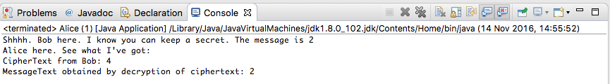

#Public key cryptography

We now implement in Java the very simple public key cryptographic problem presented in the `crypto-math` slide deck. See slides 29 to 37 inclusive.

Before proceeding it is worth understanding a number of important points regarding public-key cryptography:

- A public-private key pair could be considered to be generated by splitting an existing key into complementary keys, one private the other public.
- What we mean by private is that the owner of the keys retains this key for his or her personal use, never discloses it to a third party, keeps it safe and protects it with a password to prevent prying eyes from using it should it somehow fall into the wrong hands. We shall not deal with how this is achieved. 
- The public key is what it implies, public. These often reside on public key servers and are accessible to all.
- A message encrypted with the public key can only be decrypted with the associated private key.
- A message encrypted with the private key (this is called signing) can be decrypted with the public key (called verification).

##Encryption

- Create a Java project in Eclipse named `key_exchange` and a package within the project similarly named.
- Create two classes, Alice and Bob.
    - Alice shall generate a key pair and:
    - Pass the public key from this pair to Bob who shall:
    - Encrypt a message using the public key and pass back to Alice.
    - Alice shall use her private key to decrypt the message.

We shall use very small prime numbers to facilitate understanding. But in reality, as already pointed out, huge prime numbers are used, numbers that may in some circumstances contain as many as 600 digits (approximately 2000 bits).

Alice:

```

package public_key_crypto;

import java.math.BigInteger;
/**
 * A class to demonstrate the use of public key cryptography.
 * Two different prime numbers are multiplied to obtain the modulus.
 * The public and private key components, e and d, are supplied only, not calculated.
 * For those interested in the calculation details consult Brit Close course on KhanAcademy.
 * Additionally Eddie Woo has uploaded two very simple YouTube videos dealing with this.
 * Both these are referenced at the foot of one or both accompanying slide decks.
 */
public class Alice {

  // Select 2 prime numbers. In reality 300+ digits long each.
  private static BigInteger p = BigInteger.valueOf(2);
  private static BigInteger q = BigInteger.valueOf(7);

  public static BigInteger Z = p.multiply(q); // Modulus = p x q
  
  /**
   * Derivation of e & d and relationship between them explained here:
   * @see http://bit.ly/2g9Tyaf
   */
  public static BigInteger e = BigInteger.valueOf(5); // Public exponent used to encrypt
  private static BigInteger d = BigInteger.valueOf(11); // Alice's private key used to decrypt 
  

}
```

Bob:

```
public class Bob {

  /**
   * Public key (e, Z) obtained from Alice
   */
  public BigInteger e; // Encrypting exponent 
  public BigInteger Z; // The  modulus
  private BigInteger message = BigInteger.valueOf(2); // Private plain text message
  
  /**
   * Create Bob, providing the public key set as parameters.
   * @param e
   * @param Z
   */
  public Bob(BigInteger e, BigInteger Z) {
    this.e = e;
    this.Z = Z;
    System.out.println("Shhhh. Bob here. I know you can keep a secret. The message is " + message);
  }
  

}
```

Now add a method to Bob to encrypt a message. 

```
  /**
   * c = m^e mod Z, i.e. m raised to the power of e modulo Z.
   * @return The ciphertext
   */
  public BigInteger encryptMessage() {
    return message.modPow(e, Z);
  }
```

It only remains for Alice to 

- Create a Bob instance, 
- Invoke Bob's method to encrypt Bob's secret message,
- Decrypt the encrypted version of Bob's secret message and
- Output the results.

All this can be achieved within `main` as follows:

```
  public static void main(String[] args) {
    // Instantiate Bob and encrypt his private message
    Bob bob = new Bob(e, Z);
    BigInteger cipherText = bob.encryptMessage();
    
    //Alice uses her private key to decrypt and output result.
    BigInteger message = cipherText.modPow(d, Z);

    System.out.println("Alice here. See what I've got: ");
    System.out.println("CipherText from Bob: " + cipherText);
    System.out.println("MessageText obtained by decryption of ciphertext: " + message);
  }
```
Build and run. The output should be similar to that shown in Figure 1.


